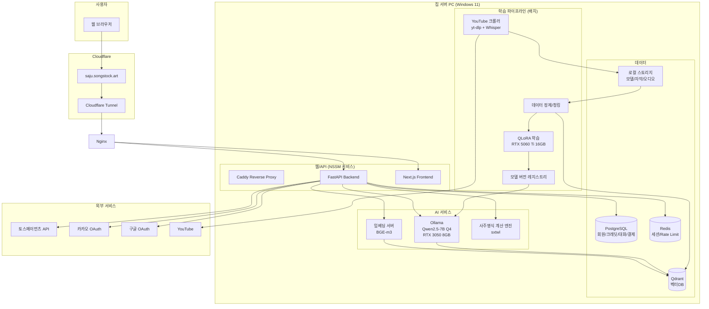

# 사주 Agent 시스템 구현 계획서

> 작성일: 2026-05-30
> 기반 문서: `SAJ_agent_시스템 설계.md`

---

## 0. 확정된 기술 결정사항

| 영역 | 결정 |
|---|---|
| **LLM 모델** | **Qwen2.5-7B-Instruct** (Apache-2.0, 상업이용 가능, 128K 컨텍스트) + **RAG 메인** + **QLoRA 도메인 튜닝 보조** |
| **과금 모델** | **질문 횟수 기반: 1질문 = 1,000 크레딧 = 1,000원** (10,000원 충전 시 10질문) |
| **호스팅 OS** | **Windows 11 네이티브 (전 기능 Windows에서 동작)** + Cloudflare Tunnel |
| **추론 런타임** | **Ollama for Windows** (Qwen2.5-7B Q4_K_M 양자화) |
| **학습 런타임** | **Windows + PyTorch CUDA 12.x + bitsandbytes-windows + Unsloth** (QLoRA) |
| **GPU 분배** | 학습: RTX 5060 Ti 16GB / 추론: RTX 3050 8GB (모델 레지스트리로 분리) |
| **결제 PG** | 토스페이먼츠 |
| **인증** | 이메일 + 소셜로그인 (카카오 / 구글) |
| **DB 스택** | PostgreSQL (메인) + Qdrant (벡터) + Redis (세션/캐시) — 모두 Windows 네이티브 또는 Docker Desktop 컨테이너 |
| **사주 UI 레퍼런스** | 원광만세력 (https://wonkwangdigital.com/) |
| **구현 우선순위** | **1) 사주명식 엔진 + 채팅 코어** → 2) 인증/크레딧/결제 → 3) 학습 파이프라인 |

---

## 1. 전체 시스템 아키텍처



---

## 2. 기술 스택

### 백엔드
- **Python 3.11** / **FastAPI** / **Uvicorn + Gunicorn**
- **SQLAlchemy 2.x** + **Alembic** (마이그레이션)
- **Pydantic v2** (스키마 검증)
- **APScheduler** 또는 **Celery + Redis** (정기 학습/크롤링 잡)
- **httpx** (외부 API 호출)

### 프론트엔드
- **Next.js 14 (App Router)** + **TypeScript**
- **TailwindCSS** + **shadcn/ui**
- **Zustand** (상태관리), **TanStack Query** (서버 상태)
- **react-markdown** + 채팅 UI 컴포넌트

### AI / LLM
- **베이스 모델 후보**:
  - `Qwen/Qwen2.5-7B-Instruct` (한국어 강함, Apache-2.0)
  - `LGAI-EXAONE/EXAONE-3.5-7.8B-Instruct` (한국어 최강급, 비상업/상업라이선스 확인 필요)
  - `beomi/Llama-3-Open-Ko-8B` (대안)
- **추론**: **vLLM** (성능) 또는 **Ollama** (편의), 4bit 양자화(AWQ/GPTQ)
- **임베딩**: `BAAI/bge-m3` (다국어, 한국어 우수) — 추론서버에 함께 로딩
- **파인튜닝**: **QLoRA** (`peft` + `bitsandbytes` + `trl SFTTrainer`)
- **RAG 프레임워크**: **LlamaIndex** 또는 직접 구현(LangChain은 선택)

### 데이터 수집
- **yt-dlp** (YouTube 자막/오디오 다운로드)
- **youtube-transcript-api** (자막 우선)
- **faster-whisper** (자막 없을 때 STT, large-v3 모델)

### 사주 엔진
- **`sxtwl`** (만세력 계산, 절기 정확) — 메인
- **`KoreanLunarCalendar`** (양↔음 변환 보조)
- 자체 검증 테스트셋(원광만세력 결과와 비교) 100건 이상

### 인프라 (Windows 11 네이티브)
- **Cloudflare Tunnel** (`cloudflared.exe` Windows 서비스)
- **Caddy for Windows** (리버스 프록시, 자동 HTTPS) — Nginx 대신 Windows 친화적
- **Docker Desktop for Windows** (WSL2 백엔드, PostgreSQL/Qdrant/Redis 컨테이너 실행)
  - 또는 PostgreSQL은 Windows 네이티브 설치, Qdrant/Redis만 컨테이너
- **NSSM (Non-Sucking Service Manager)** — FastAPI/Next.js를 Windows 서비스로 등록 (Systemd 대체)
- **작업 스케줄러 (Task Scheduler)** — 정기 학습/크롤링 잡 (Cron 대체)
- **Prometheus + Grafana for Windows** + **Windows Event Log → Promtail → Loki**
- **백업**: `pg_dump` + 모델 체크포인트 외장 SSD (Robocopy 스케줄)

---

## 3. 데이터 모델 (PostgreSQL 핵심 테이블)

```sql
-- 회원
users(id, email, password_hash, oauth_provider, oauth_id, nickname, 
      role, is_adult, created_at, last_login_at)

-- 사주 프로필 (생년월일은 AES 암호화 저장)
saju_profiles(id, user_id, name, birth_date_enc, birth_time, 
              calendar_type, gender, is_leap_month, saju_pillars_json, 
              created_at)

-- 크레딧
credits(id, user_id, balance, updated_at)
credit_transactions(id, user_id, delta, reason, ref_id, created_at)
-- reason: 'purchase', 'question_charge', 'refund', 'bonus'

-- 결제
payments(id, user_id, toss_payment_key, order_id, amount, status, 
         credit_granted, created_at, approved_at)

-- 채팅 세션
chat_sessions(id, user_id, saju_profile_id, started_at, ended_at, 
              total_questions, total_credits_used)
chat_messages(id, session_id, role, content, tokens, 
              retrieved_chunks_json, credits_charged, created_at)

-- LLM 모델 레지스트리
llm_models(id, name, version, base_model, lora_path, quantization, 
           status, vram_required_mb, deployed_at)
-- status: 'training', 'staged', 'production', 'archived'

-- 학습 데이터
knowledge_sources(id, source_type, url, channel, title, 
                  transcript_path, processed_at)
-- source_type: 'youtube', 'book', 'manual', 'user_upload'
knowledge_chunks(id, source_id, chunk_text, embedding_id_qdrant, 
                 metadata_json)

-- 사용자 업로드 영상 (Phase 6.5)
user_uploads(id, user_id, status, original_filename, file_path,
             mime_type, file_size_bytes, duration_sec,
             title, description, source_note, tags,
             transcript_path, char_count,
             decision, decision_reason, decided_by, decided_at,
             knowledge_source_id, created_at, updated_at)
-- status: received|transcribing|pending_review|approved|rejected|ingested|failed

-- 감사/로그
audit_logs(id, user_id, action, payload_json, ip, created_at)
```

---

## 4. 핵심 사용자 플로우

### 4.1 신규 사용자 → 사주 상담 → 결제
```
1. 회원가입 (이메일/카카오/구글) + 19세 이상 확인 + 약관 동의
2. 생년월일/시/양음력 입력
3. 사주명식 계산 → 시각화 (8글자 사주판 + 오행 차트)
4. 기본 사주 풀이 자동 생성 (무료, RAG 기반 1회)
5. 추가 질문 유도 팝업 → 크레딧 안내
6. 크레딧 부족시 결제 페이지 (10,000 / 30,000 / 50,000 크레딧 패키지)
7. 토스페이먼츠 결제 → 웹훅으로 크레딧 충전
8. 질문 입력 → 사주 컨텍스트 + RAG 검색 + LLM 응답
9. 응답 완료 시 크레딧 차감 (**1,000 크레딧 / 1질문**)
10. 대화 이력 저장
```

### 4.2 정기 학습 파이프라인 (Cron, 매주 일요일 03:00)
```
1. 4개 채널 신규 영상 목록 조회 (yt-dlp --dateafter)
2. 자막 우선 다운로드, 없으면 오디오 → faster-whisper STT
3. 정제 (광고/인사/잡담 제거 LLM 필터)
4. 의미 단위 청킹 (500~800 토큰, 50 토큰 오버랩)
5. BGE-m3 임베딩 → Qdrant 업서트
6. 정제 텍스트는 SFT 학습 데이터 후보 큐에 적재
7. 일정 분량 누적시 (예: 5천 샘플) QLoRA 학습 트리거
8. 학습 완료 → 평가셋(100문) 자동 채점 → 기준 통과시 'staged'
9. 운영자 승인시 'production' 전환 → 추론 서버 핫스왑
```

---

## 5. 보안 / 법적 준수

- **HTTPS**: Cloudflare 인증서 자동
- **비밀번호**: bcrypt (cost=12)
- **JWT**: Access 15분 / Refresh 14일, Refresh는 Redis 화이트리스트
- **생년월일 암호화**: AES-256-GCM, 키는 환경변수/시크릿
- **CSRF/XSS**: SameSite=Lax 쿠키, CSP 헤더
- **Rate Limit**: Redis 기반, IP/계정별
- **개인정보처리방침** / **이용약관** / **환불정책** 페이지 필수
- **면책 고지**: "본 서비스는 오락 목적이며 의료/법률/투자 자문이 아닙니다"
- **미성년자 차단**: 가입시 생년월일 검증
- **결제 로그**: 5년 보관 (전자상거래법)
- **통신판매업 신고** (매출 발생 시)

---

## 6. 단계별 마일스톤 (사주엔진 + 채팅 코어 우선)

### **Phase 0 — Windows 11 개발환경 셋업** (3~5일)
- [ ] Python 3.11 (python.org installer), Node.js 20 LTS, Git for Windows
- [ ] CUDA Toolkit 12.x + cuDNN (NVIDIA 드라이버 최신)
- [ ] PyTorch CUDA 빌드 설치 검증 (`torch.cuda.is_available()`)
- [ ] Docker Desktop for Windows (WSL2 백엔드) — Qdrant/Redis 컨테이너용
- [ ] PostgreSQL 16 for Windows 네이티브 설치
- [ ] Ollama for Windows 설치 + `ollama pull qwen2.5:7b-instruct-q4_K_M`
- [ ] 프로젝트 디렉토리 구조 생성, Git 초기화, `.venv` 가상환경
- [ ] Pre-commit (black, ruff, mypy) 셋업

### **Phase 1 — 사주명식 계산 엔진 (코어, 최우선)** (1~2주)
- [ ] `sxtwl` 기반 만세력 모듈
  - 양/음력 → 사주 8자 (년주/월주/일주/시주)
  - 24절기 정확 처리 (월주 절입 기준)
  - 시주 자시 처리 규칙 (조자시 23:30~00:30 / 야자시)
  - 윤달 처리
- [ ] 대운/세운 계산 (순행/역행, 대운수)
- [ ] 오행 분포 / 십성 / 지장간 / 합충형파해 분석
- [ ] 신강/신약 판별
- [ ] **원광만세력 결과 대조 테스트 100건** (pytest, 정확도 100% 목표)
- [ ] CLI 도구: `python -m saju.cli --birth 1990-03-15 --time 14:30 --calendar solar`

### **Phase 2 — RAG 지식베이스 + 채팅 코어** (2주) ⭐ "사주 학습엔진 코어-채팅"
- [ ] 학습자료 폴더 PDF/TXT/DOCX 파싱 (`pypdf`, `python-docx`, `unstructured`)
- [ ] 의미 단위 청킹 (500~800 토큰, 50 토큰 오버랩)
- [ ] BGE-m3 임베딩 서버 (FastAPI, `sentence-transformers` Windows 호환)
- [ ] Qdrant 컬렉션 생성 + 청크 업서트 스크립트
- [ ] Ollama Qwen2.5-7B 추론 래퍼 (스트리밍 지원)
- [ ] **RAG 프롬프트 템플릿**
  - 시스템: "당신은 50년 경력의 사주 명리학자입니다..."
  - 컨텍스트: 사주명식(8자 + 대운/오행) + 검색된 지식청크 5~10개
  - 사용자 질문
- [ ] **CLI 채팅 데모**: 생년월일 입력 → 사주명식 출력 → 무한 질문/답변 루프
- [ ] 답변 품질 평가셋 30~50문 + 수동 채점

### **Phase 3 — FastAPI 백엔드 + 채팅 웹 API** (2주)
- [ ] FastAPI 프로젝트 구조 (라우터/서비스/리포지토리 분리)
- [ ] SQLAlchemy 2 + Alembic 마이그레이션, 시드 데이터
- [ ] 사주 프로필 CRUD + 사주명식 API
- [ ] 채팅 세션 API + **SSE 스트리밍** (Ollama → 클라이언트 토큰 단위 전송)
- [ ] 대화 이력 저장 + 컨텍스트 윈도우 관리
- [ ] 기본 인증(임시 이메일/패스워드) — OAuth는 Phase 5

### **Phase 4 — 프론트엔드 (사주 + 채팅 UI)** (2~3주)
- [ ] Next.js + Tailwind 셋업, 디자인 시스템 (shadcn/ui)
- [ ] 랜딩/회원가입/로그인
- [ ] 생년월일 입력 폼 (양/음/윤달/시)
- [ ] **사주명식 시각화 컴포넌트** (원광만세력 레이아웃 참고: 천간/지지 2x4 그리드, 오행 원형 차트, 십성/지장간)
- [ ] 채팅 UI (스트리밍, 마크다운, 크레딧 잔액 표시)
- [ ] 크레딧 잔액 부족 모달

### **Phase 5 — 결제** (1~2주)
- [ ] 토스페이먼츠 SDK 연동 (결제창/위젯)
- [ ] 결제 승인 + 웹훅 → 크레딧 충전 (멱등성 보장)
- [ ] 결제 내역/환불 페이지
- [ ] 영수증 (현금영수증/세금계산서 옵션)

### **Phase 6 — 데이터 수집 파이프라인** (2주)
- [ ] yt-dlp 채널별 신규 영상 감지 (DB 워터마크)
- [ ] 자막 우선, 없으면 faster-whisper STT
- [ ] 정제 LLM 필터 (광고/잡담 제거)
- [ ] 청킹 + 임베딩 + Qdrant 업서트
- [ ] APScheduler 주간 잡 등록
- [ ] 운영자 대시보드 (수집 현황)

### **Phase 6.5 — 사용자 MP4 업로드 게시판** (1주)
> 사용자가 자체 영상 파일을 올려 학습/답변에 반영시키는 경로. 운영자 승인 후 RAG 코퍼스에 편입.
- [ ] 업로드 게시판 UI (공지사항 스타일 목록 + 업로드 버튼)
  - 제먩/설명/출처/태그 + mp4/mov/mkv/m4a/mp3 파일
  - 파일 크기 제한 (예: 2GB) + 원장자 동의 체크박스 필수
- [ ] FastAPI 업로드 엔드포인트 (청크 업로드, presigned-like 토큰)
- [ ] DB 테이블 `user_uploads(id, user_id, status, file_path, title, description, duration_sec, transcript_path, decision, decided_by, decided_at, created_at)`
  - status: `received` → `transcribing` → `pending_review` → `approved`|`rejected` → `ingested`
- [ ] 업로드 완료 이벤트 → 다음 스케줄러 잔업:
  - ffmpeg 메타추출(길이/오디오 유무)
  - faster-whisper STT → 정규화 텍스트 저장
  - 미리보기(체점: 텍스트 품질/도메인 관련성) → 운영자 검토 큐
- [ ] 운영자 대시보드 승인/거절 버튼
  - 승인: 청크→임베딩→Qdrant 업서트 (`category="user_upload"`, `user_id`, `upload_id` payload)
  - 거절: 사유 명시 + 원본 파일 수일 재업로드 권고
- [ ] 저작권/개인정보 가드
  - 업로드 전 "본인이 소유하거나 적법한 권리가 있으며 학습 반영에 동의"
  - 관리자는 조건부 삭제 가능 (DB·색인·원본 동시 제거)
- [ ] 크레딧 정책 (필요시): 업로드 텍스트 분량 기준 보너스 크레딧 지급 또는 소량 차감

### **Phase 7 — 파인튜닝(QLoRA) 파이프라인** (2~3주)
- [ ] SFT 데이터 형식 변환 (instruction/input/output)
- [ ] QLoRA 학습 스크립트 (5060 Ti 16GB, batch=1~2, grad accum)
- [ ] 학습 평가 자동화 (eval set + LLM judge)
- [ ] 모델 레지스트리 + 핫스왑 (3050 추론 서버 재로드 API)
- [ ] A/B 비교 도구

### **Phase 8 — 운영 안정화 (Windows)** (2주)
- [ ] Prometheus / Grafana for Windows + Loki
- [ ] **NSSM으로 FastAPI / Next.js / Ollama / Caddy / cloudflared를 Windows 서비스 등록** (부팅시 자동 기동)
- [ ] **작업 스케줄러**: 일일 백업 (`pg_dump` + Robocopy), 주간 학습 잡
- [ ] 부하 테스트 (locust)
- [ ] 약관/정책 페이지, 운영자 어드민
- [ ] Windows Defender 예외 규칙 (PostgreSQL/Ollama 디렉토리)

### **Phase 9 — 베타 → 정식 오픈**
- [ ] 지인 클로즈드 베타
- [ ] 통신판매업 신고
- [ ] 정식 오픈, 모니터링

---

## 7. 디렉토리 구조 (제안)

```
Saju_Agent/
├── docs/                          # 설계 문서
├── infra/
│   ├── docker-compose.yml         # Qdrant / Redis (Docker Desktop)
│   ├── caddy/Caddyfile            # Caddy 리버스 프록시 설정
│   ├── cloudflared/config.yml     # Cloudflare Tunnel
│   └── nssm/                      # NSSM 서비스 등록 스크립트(.ps1/.bat)
├── backend/                       # FastAPI
│   ├── app/
│   │   ├── api/                   # 라우터
│   │   ├── core/                  # 설정/보안
│   │   ├── domain/                # 엔티티/DTO
│   │   ├── services/              # 비즈니스 로직
│   │   ├── repositories/          # DB 접근
│   │   ├── saju/                  # 사주 계산 엔진 (Phase 1)
│   │   ├── rag/                   # 검색/프롬프트 (Phase 2)
│   │   └── integrations/          # 토스/카카오/구글
│   ├── alembic/
│   ├── tests/
│   └── pyproject.toml
├── frontend/                      # Next.js
│   ├── app/
│   ├── components/
│   │   └── saju/                  # 사주명식 시각화
│   └── package.json
├── ml/
│   ├── inference/                 # Ollama Modelfile / 서빙 설정
│   ├── training/                  # QLoRA 스크립트 (Unsloth)
│   ├── eval/                      # 평가셋/스크립트
│   ├── data_pipeline/             # 크롤러/STT/청킹
│   └── models/                    # 체크포인트 (.gitignore)
├── 학습자료/                       # 기존 자료
└── scripts/                       # PowerShell 운영 스크립트 (.ps1)
```

---

## 8. 예상 비용 (월간)

| 항목 | 비용 |
|---|---|
| 전기료 (PC 24/7, 약 250W 평균) | 약 25,000~40,000원 |
| Cloudflare (Free 플랜) | 0원 |
| 도메인 (.art 연간) | 약 2,000원/월 환산 |
| 토스페이먼츠 수수료 | 매출의 약 2.8~3.3% |
| 카카오/구글 OAuth | 0원 |
| **합계 (트래픽 제외)** | **약 3~4만원/월** |

---

## 9. 리스크 & 대응

| 리스크 | 대응 |
|---|---|
| 7B 모델 한국어 사주 도메인 답변 품질 부족 | RAG 비중↑, 평가셋으로 임계점 검증, 필요시 14B 모델 + 5060Ti 추론 전환 |
| 동시접속 증가시 3050 추론 병목 | 큐잉(Celery) + 동시 1~2명 제한, 트래픽 증가시 모델/GPU 업그레이드 |
| YouTube 약관 이슈 | 자막은 지식 추출용으로만, 원문 재현 금지, 출처 명시, 채널 소유자 사전 문의 권장 |
| 사주 계산 오차 | 원광만세력 비교 100건 테스트 통과 필수, 시주 자시 처리 명확화 (23:30 기준) |
| 결제 분쟁 | 면책 고지 + 환불 정책 + 답변 만족도 평가로 자동 환불 트리거 |
| 모델 학습 실패/품질 저하 | 'staged' 단계 의무, 평가 미달시 자동 롤백 |
| 가정용 PC 다운타임 | UPS + 일일 백업, 핵심 정적 페이지는 Cloudflare Pages 미러 |

---

## 10. 결정 필요 추가 항목

다음 단계 진행 전 확인이 필요합니다:

1. **EXAONE-3.5 vs Qwen2.5**: EXAONE은 한국어 최강이나 상업적 라이선스 재확인 필요. 우선 Qwen2.5로 시작 권장.
2. **WSL2 vs Ubuntu 듀얼부팅**: GPU 학습 안정성은 네이티브 Ubuntu가 우수. WSL2도 가능하나 일부 제약.
3. **Phase별 우선순위 변경 여부**: 위 순서대로 진행할지, 특정 phase 병렬화할지.
4. **베타 오픈 시점 목표일**.

---

다음 단계: 위 계획에 OK 하시면 **Phase 0 환경 셋업부터 실제 코드/설정 작성**을 시작합니다.

---

# 11. 갭 분석 & 추가 개발 계획 (2026-06-01 업데이트)

> 사용자 신규 요건(설계서 갱신: 관리자 2명, Gemini UX, kangtaegong 광고, start.bat, Cloudflare CLI 등) 반영.
> 분석 기준: `SAJU_agent_시스템 설계.md` (최신) vs 현재 코드 (`backend/`, `frontend/`, `infra/`).

## 11.1 구현 현황 요약

| 영역 | 상태 | 비고 |
|---|---|---|
| Phase 0 환경/인프라 | ✅ 완료 | Docker, PG, Ollama, BGE-m3, Qdrant |
| Phase 1 사주엔진 | ✅ 완료 | 44 tests pass, CLI 동작 |
| Phase 2 RAG + CLI 채팅 | ✅ 완료 | 1,118 chunks, smoke pass |
| Phase 3 FastAPI 채팅 API | ✅ 완료 | 세션 PG 영속화 완료 |
| Phase 3.5 세션 영속화 | ✅ 완료 | ChatSession/ChatMessage ORM |
| Phase 4 프론트(React/Vite) | 🟡 기초만 | 3페이지(채팅/업로드/추세) — Gemini UX/광고/사이드바 없음 |
| Phase 5 회원/크레딧/결제 | ❌ 미착수 | **신규 요건 대거 추가** |
| Phase 6 YouTube 파이프라인 | 🟡 진행중 | 46/457 자막 수집, IP 차단으로 지연 |
| Phase 6.5 업로드 게시판 | ✅ 백엔드 완료 | 운영자 큐 UI는 임시(권한 없음) |
| Phase 6.6 평가 인프라 | ✅ 완료 | runs.jsonl + 추세 차트 |
| Phase 7 QLoRA 학습 | ❌ 미착수 | 데이터 누적 대기 |
| Phase 8 운영 안정화 | ❌ 미착수 | NSSM/Caddy/Cloudflared 미설정 |

## 11.2 신규 요건 ↔ 미구현 항목 매핑

### A. 관리자 시스템 (신규)
- [ ] `users.role` ENUM(`user`/`admin`) — 시드 2명: `orion0321@gmail.com`, `yeon6787@naver.com` (초기 비번 `!thdwlstn00`, 최초 로그인 시 변경 권고)
- [ ] 관리자 권한 가드 (`require_admin` Depends)
- [ ] 관리자 전용 화면: **회원관리 / 접속자 현황(그래프) / 업로드 큐 / 학습탭 / 학습효율 탭 / 배너관리**
- [ ] 비관리자에는 메뉴 자체 숨김 + API 403

### B. 회원/인증 (Phase 5)
- [ ] `users` 테이블 + Alembic 마이그레이션 도입 (현재 `create_all`만 사용)
- [ ] 이메일+패스워드(bcrypt) 가입/로그인
- [ ] **카카오 / 구글 OAuth** (redirect + token 교환)
- [ ] JWT (Access 15분 / Refresh 14일, Redis 화이트리스트)
- [ ] 회원가입 시 **1,000 크레딧 보너스 자동 지급**
- [ ] 19세 이상 검증 (생년월일 기반)
- [ ] 약관/개인정보/환불정책 페이지 + 동의 체크

### C. 크레딧/결제 (Phase 5)
- [ ] `credits`, `credit_transactions`, `payments` 테이블
- [ ] **질문당 1,000 크레딧 차감 미들웨어** (사주명식·기본 풀이는 차감 0; "추가 질문"부터 차감)
- [ ] **답변 분량 가드**: A4 0.5p ≈ 한글 600~800자 미만이면 재생성 또는 보강 프롬프트 (LLM `min_tokens`/재시도 1회)
- [ ] 토스페이먼츠 결제창 + 승인 콜백 + **웹훅 멱등성** (`order_id` unique)
- [ ] 충전 패키지: 10,000 / 30,000 / 50,000 크레딧 (1포인트=1원)
- [ ] 환불/내역 페이지

### D. Gemini 스타일 채팅 UX (Phase 4 재설계)
- [ ] **사이드바 대화 히스토리** + "새 대화" 버튼 (Gemini 동일 레이아웃)
- [ ] **첫 질문 temp 저장 흐름**: 미인증/생일 미입력 시 질문 보관 → 생년월일 입력 모달 → 일주 표시 후 답변 50% 미리보기 → SNS 가입 유도 팝업 → 가입 후 풀 답변
- [ ] **추가 질문 1,000P 안내 팝업** (잔액 표시 + 결제 유도)
- [ ] 반응형(모바일/PC) + 마크다운 렌더링 + **SSE 스트리밍** (현재 동기 응답)
- [ ] **사주명식 시각화 컴포넌트** (원광만세력 8글자 그리드 + 오행 원형 + 십성/지장간) — 현재는 텍스트만

### E. 광고 시스템 (kangtaegong 참조)
- [ ] `banners` 테이블 (slot, image_url, link_url, active, weight)
- [ ] 슬롯 정의:
  - 상단 SAJU 배너 (관리자 등록)
  - **메인 채팅 입력창 상단**: PC 가로 2, 모바일 세로 2 (Google AdSense)
  - **사이드바 하단**: 세로 2 (Google AdSense)
  - **답변 완료 하단**: 타겟 배너
- [ ] AdSense 클라이언트 ID 설정 + 광고 컴포넌트 (`<AdSlot slot="chat_top" />`)
- [ ] 관리자 배너 CRUD 화면

### F. 인프라/배포 (Phase 8 재정의)
- [ ] **`/start.bat`** (워크스페이스 루트): 
  - 포트 점검(5173, 8000, 5432, 6379, 6333, 11434)
  - 충돌 시 PID 식별 후 종료(`Stop-Process`) → 재기동
  - 순서: Docker(Qdrant/Redis) → PG 서비스 → Ollama → uvicorn(8000) → vite(5173)
  - 헬스체크(`/api/health/deps`) 통과 후 브라우저 자동 오픈
- [ ] **`stop.bat`** (대칭)
- [ ] **Cloudflare Tunnel CLI 구성**: `cloudflared.exe tunnel create saju-songstock` → `tunnel route dns saju saju.songstock.art` → `config.yml`(ingress→127.0.0.1:8000/5173) → NSSM 서비스 등록
- [ ] **Caddy** 리버스 프록시 (로컬 HTTPS, `/api`→8000, `/`→5173)
- [ ] NSSM: `saju-backend`, `saju-frontend`, `saju-cloudflared`, `saju-caddy` 등록
- [ ] 작업 스케줄러: 일일 `pg_dump` + Robocopy 외장 SSD

### G. 운영/모니터링
- [ ] 관리자 **접속자 현황 그래프** (일별 활성 사용자, 질문 수, 크레딧 소비)
  - `audit_logs` 또는 `access_logs` 테이블 + 일별 집계 API
- [ ] **학습 효율 탭** = 기존 `/api/eval/runs` 추세 + 모델 버전별 비교
- [ ] 회원 검색/정지/크레딧 수동 조정

### H. Phase 6.5 보강
- [ ] 운영자 권한으로만 업로드 승인 화면 노출 (현재 누구나)
- [ ] 업로드 사용자 식별(현재 비식별) — 회원 시스템 도입 후 연계

### I. Phase 7 QLoRA (데이터 누적 후)
- [ ] YouTube 자막 ≥ 200편 수집 완료를 트리거로
- [ ] Unsloth + bitsandbytes(Windows) SFT 스크립트, 5060 Ti 16GB
- [ ] 자동 평가셋 통과 시 `staged` → 운영자 승인 → `production` 핫스왑

## 11.3 추가 Phase 정의 (신규/세분화)

### **Phase 5A — 인증 기반 (1주)**
1. Alembic 도입 + `users` 테이블 + 관리자 2명 시드
2. 이메일/패스워드 가입/로그인 + JWT
3. `require_user` / `require_admin` Depends
4. 모든 기존 API에 인증 옵션 부착 (chat은 익명+temp 허용)

### **Phase 5B — 소셜 로그인 (3일)**
- 카카오 / 구글 OAuth (`authlib` 또는 `httpx` 직접)
- 가입 시 1,000 크레딧 자동 지급

### **Phase 5C — 크레딧/결제 (1.5주)**
- `credits/credit_transactions/payments` + 차감 미들웨어
- 토스페이먼츠 위젯 + 웹훅
- 답변 분량 가드(600자 미만 재생성 1회)

### **Phase 4A — Gemini UX 리디자인 (1.5주)**
- 사이드바 히스토리 + "새 대화"
- temp 질문 → 생년월일 모달 → 50% 미리보기 → 가입 유도 플로우
- SSE 스트리밍 채택 (`StreamingResponse` + Ollama stream)
- 사주명식 시각화 컴포넌트
- 모바일 반응형

### **Phase 4B — 광고/배너 (3일)**
- `banners` CRUD + 슬롯 컴포넌트
- AdSense 슬롯 4종 배치

### **Phase 4C — 관리자 콘솔 (1주)**
- 권한 가드 + 메뉴 분기
- 회원관리 / 접속자 그래프 / 업로드 큐 / 학습효율 / 배너관리
- 일별 집계 API + recharts/SVG 그래프

### **Phase 8A — 원클릭 기동 (3일)**
- `start.bat` / `stop.bat`
- Cloudflare Tunnel CLI 등록
- Caddy + NSSM 서비스화
- 부팅 시 자동 기동 검증

### **Phase 8B — 법적 페이지/약관 (2일)**
- 이용약관 / 개인정보처리방침 / 환불정책 / 면책고지
- 가입 동의 체크 + 버전 관리

## 11.4 우선순위 (권장 실행 순서)

> 사용자 핵심 가치(돈 받고 서비스 시작) 기준 정렬.

1. **Phase 5A 인증 기반** ← 모든 후속의 전제
2. **Phase 4C 관리자 콘솔(기초)** + 관리자 2명 시드 (소셜 전이라도 ID/PW로 진입)
3. **Phase 5C 크레딧/결제** (1포인트=1원, 토스 연동)
4. **Phase 4A Gemini UX + 50% 미리보기 + SSE 스트리밍**
5. **Phase 5B 소셜 로그인** (카카오/구글) + 가입 보너스 1,000P
6. **Phase 4B 광고/배너** (배포 직전)
7. **Phase 8A start.bat + Cloudflare Tunnel** (베타 배포 준비)
8. **Phase 8B 약관/정책 페이지** (오픈 직전 필수)
9. **Phase 6 YouTube 수집 완주** (백그라운드 지속)
10. **Phase 7 QLoRA** (자막 충분히 쌓인 뒤)

## 11.5 추정 일정 (현실치)

- Phase 5A+4C(관리자 기초) — 약 1.5주
- Phase 5C 결제 — 약 1.5주
- Phase 4A UX — 약 1.5주
- Phase 5B 소셜 — 약 3일
- Phase 4B 광고 — 약 3일
- Phase 8A 배포 — 약 3일
- Phase 8B 법적 — 약 2일

**클로즈드 베타까지: 약 5~6주** (단일 개발자 기준).

## 11.6 데이터 모델 추가/수정 (Alembic 마이그레이션 필요)

```sql
ALTER TABLE chat_sessions ADD COLUMN user_id BIGINT REFERENCES users(id) NULL; -- 익명 허용
-- 신규
users(id, email UNIQUE, password_hash, role, oauth_provider, oauth_id,
      nickname, birth_date, marketing_opt_in, created_at, last_login_at)
credits(user_id PK, balance INT, updated_at)
credit_transactions(id, user_id, delta INT, reason, ref_id, created_at)
payments(id, user_id, order_id UNIQUE, toss_payment_key, amount,
         status, credit_granted, created_at, approved_at)
banners(id, slot, image_url, link_url, weight, active, created_at)
access_logs(id, user_id NULL, path, status, latency_ms, created_at)
```

## 11.7 결정 확정 (2026-06-01 사용자 응답)

1. **관리자 초기비번**: `!thdwlstn00` 평문 시드 + 최초 로그인 시 강제 변경. **관리자 계정에 100,000 크레딧 자동 충전**(개발/테스트용).
2. **50% 미리보기 컷**: **글자 수 50%** 기준. 나머지는 `...` 처리 후 **"더보기" 클릭 시 500 크레딧 차감**하고 전체 노출.
3. **결제 패키지**: **1만 / 3만 / 5만 / 10만 원 (1:1 크레딧)** 4종.
   - **회원 가입 시 1,000P 기본 지급** (기존)
   - **로그인 회원 1일 1건 무료 질문** 자동 지급 (UTC+9 자정 리셋 카운터, `daily_free_used_at` 컬럼)
4. **광고 숨김**: **유료 결제 이력이 있는 회원**(또는 잔액 >0 회원)에게 광고 숨김. `users.ads_hidden` 플래그 또는 `payments` 존재 여부로 판정.
5. **사주명식 시각화**: 원광만세력 v4.0.0 캡처 제공 받음. **레이아웃·세부 항목 100% 동일**, **색상만 자체 팔레트로 변경**.
   - **입력 화면(팝업)**: 이름 / 성별(남·여 라디오) / 양·음·음력윤달 라디오 / 서기 YYYY·MM·DD 숫자 입력 / 시·분 입력 / **출생지(대한민국 -26분 등 진태양시 보정)** 드롭다운. 하단 [초기화 / 조회하기 / 인원추가] 버튼. 100% 동일 폼.
   - **결과 화면**: 상단 헤더 `이름(만나이)` + `(양)/(음)/(正)서기·正시각·小寒/입절 정보` + `대한민국(-26분)` + [명조비교] 버튼.
   - **사주판**: 시주/일주/월주/년주 4열 그리드. 각 열 위 십성(비견/일원/식신/편인 등), 천간 한자 큰 셀, 지지 한자 큰 셀, 아래 지장간 십성. 천간/지지 셀 배경색은 오행에 따라(木=청록/火=분홍/土=베이지/金=백/水=회색 → **자체 팔레트로 재정의**).
   - **오행 카운터**: `木(n) 火(n) 土(n) 金(n) 水(n)` 가로 라인.
   - **대운**: 1.3 / 11 / 21 / 31 / 41 / 51 / 61 / 71 / 81 나이 헤더 + 천간 셀 + 지지 셀 가로 9열, 현재 대운 강조.
   - **세운**: 연도(2007~2020 등) × 천간/지지 × 만나이. 현재 연도 강조.
   - **월운**: 현재 세운(`2014年(39歲) 月運`) 의 1~12월 천간/지지.
   - **메모 영역** 하단.
   - **반응형**: 모바일 세로 스크롤(원본과 동일), PC는 1행 풀폭.

## 11.8 추가 기능 (사용자 응답 반영)

### 무료 질문/미리보기 차감 정책 (정리)
| 상황 | 차감 |
|---|---|
| 비회원 첫 질문 | 0P (사주명식 + 답변 50% 미리보기만, 더보기 불가→가입 유도) |
| 가입 직후 보너스 | +1,000P |
| 가입 회원 1일 1건 무료 질문 | 0P (**50% 미리보기 적용**, 더보기는 500P 차감) |
| 일반 질문 (잔액 차감) | 1,000P (**전문 노출**, 미리보기 컷 없음) |
| 더보기(미리보기 전체 펼치기) | **500P** |
| 관리자 계정 충전 | +100,000P (시드, 미리보기 컷 없음) |

### DB 컬럼 추가
```sql
ALTER TABLE users
  ADD COLUMN must_change_password BOOLEAN DEFAULT FALSE,
  ADD COLUMN daily_free_used_at DATE NULL,
  ADD COLUMN ads_hidden BOOLEAN DEFAULT FALSE;
ALTER TABLE chat_messages
  ADD COLUMN preview_revealed BOOLEAN DEFAULT FALSE,
  ADD COLUMN reveal_credits_charged INT DEFAULT 0;
```

### 사주명식 컴포넌트 (Phase 4A 상세)
- `SajuBirthFormModal.tsx` — 입력 팝업 (원광 v4 폼 1:1)
- `SajuChart.tsx` — 결과판 (헤더 + 사주판 + 오행 + 대운 + 세운 + 월운)
- `palette.ts` — 오행 색상 토큰 (자체 팔레트, 사용자 추후 조정 가능)
  - 기본 안: 木=#3DB39E, 火=#FF6B6B, 土=#E0B97F, 金=#E8E8E8, 水=#5C7CFA
- 백엔드 `/api/saju/chart` 응답 확장 필요: 십성(年/月/日/時 천간·지장간 별), 대운 9스텝(천간/지지/시작나이), 세운 ±7년, 월운 12개월, 진태양시 보정 분(현재 `apply_true_solar_time` 토글만)

### 결제 패키지 정의 (`pricing.ts`)
```ts
export const PACKAGES = [
  { amount: 10_000, credits: 10_000 },
  { amount: 30_000, credits: 30_000 },
  { amount: 50_000, credits: 50_000 },
  { amount: 100_000, credits: 100_000 },
];
```

### 광고 숨김 판정
```python
def is_ads_hidden(user) -> bool:
    if user is None: return False
    if user.role == "admin": return True  # 관리자도 광고 노출 X
    return user.ads_hidden or user.credits.balance > 0 \
        or user.has_any_payment()
```

