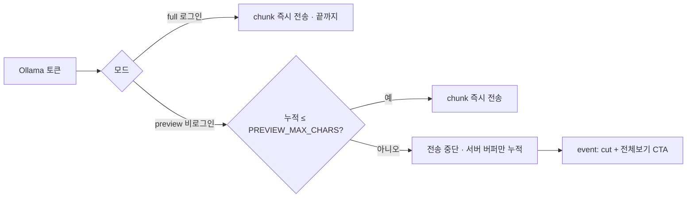
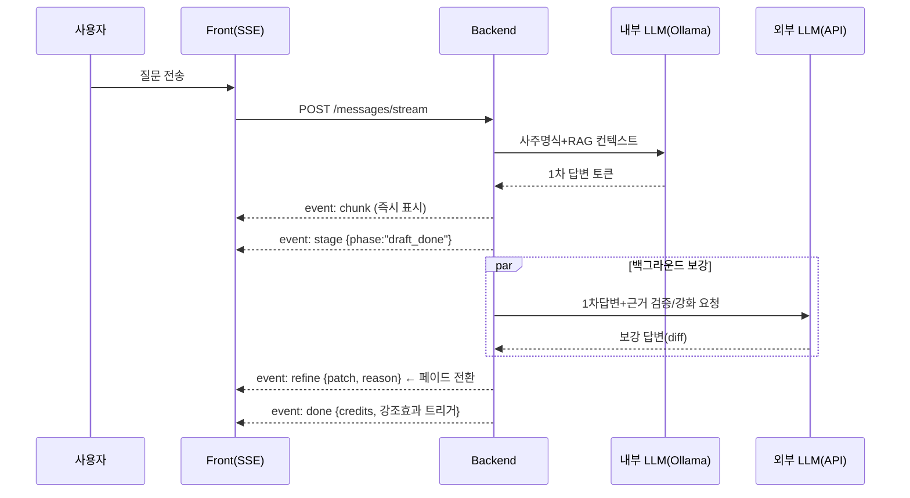
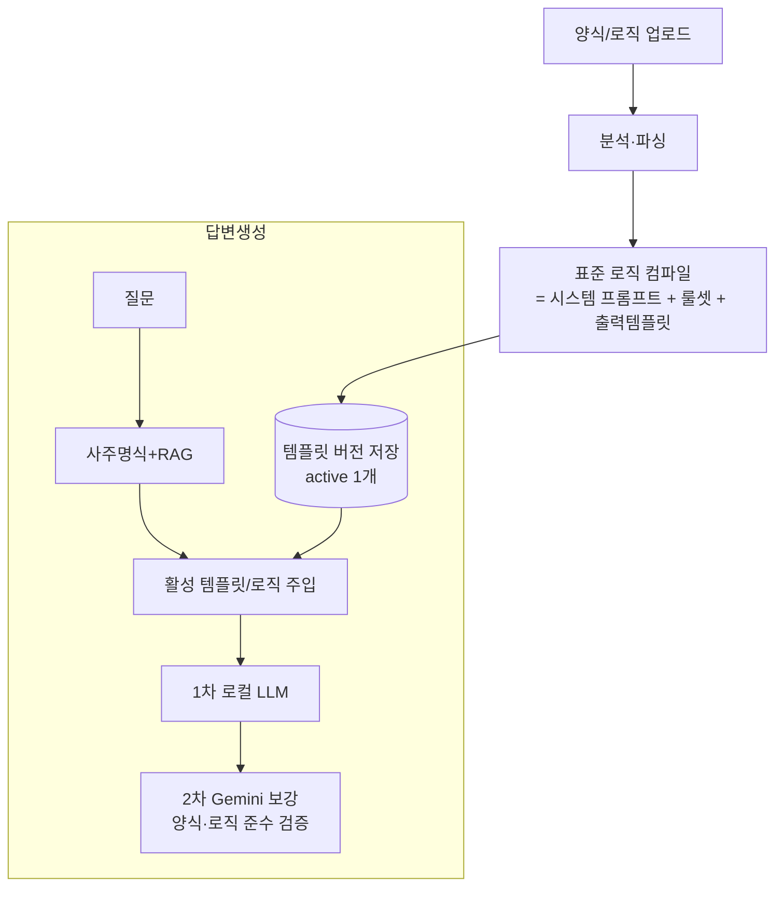
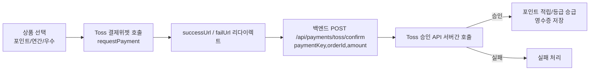

# 사주 Agent 2차 개발계획서 — UI 개편 · 듀얼 LLM · 회원등급 · 524 오류

> 작성일: 2026-06-06
> 대상: 현재 운영 코드(`frontend/`, `backend/app/`) 기준
> 요청 출처: 사용자 요건(Gemini 동일 UI / 듀얼 LLM 답변 / 회원등급 / 채팅 524 오류)

---

## 0. 요약 (Executive Summary)

| # | 항목 | 현재 상태 | 목표 | 난이도 |
|---|---|---|---|---|
| A | **채팅 524 오류** | 프리뷰 모드가 무음 블로킹 → Cloudflare 100초 타임아웃 | SSE 하트비트 + 프리뷰 스트리밍화 | ★★ (즉시) |
| B | **Gemini 동일 UI** | 카드 나열식, 테마 없음 | Gemini 2-pane 레이아웃 100% 재현 + 맑은 파랑 포인트 | ★★★ |
| C | **반응형/자동높이 입력** | `<input>` 고정 단행 | `<textarea>` auto-grow, 가로 꽉참 | ★★ |
| D | **철학관 배너 영역** | 일반 광고 배너만 | 채팅 상단 "철학관 이름" 입력/표시 영역 | ★ |
| E | **사주 원색 적용** | 파스텔(오행색) | 노랑/파랑/빨강/회색 고채도, 가독성 확보 | ★ |
| F | **듀얼 LLM (1차 내부→2차 외부 보강)** | 내부 Ollama 단일 | 내부 즉답 → 외부 LLM 검증/보강 페이드 전환 | ★★★★ |
| G | **근거 명시(사주명식 기반)** | RAG 출처만 표시 | 사주명식 근거 구조화 출력 | ★★★ |
| H | **질문 비용 선택 + 무료 한도** | 고정 1,000원 차감 | 선택형 과금(기본/심화) + 일반회원 무료 3회 후 결제 유도, 차감액·무료횟수 관리자 설정 | ★★ |
| I | **회원 등급 Level0~5** | role: user/admin 2종 | 6단계 등급 + 권한/포인트 정책 | ★★★★ |
| J | ~~DB: PostgreSQL → MySQL~~ | PostgreSQL(psycopg) | **요건 철회 — PostgreSQL 그대로 유지** | — |
| K | **SNS 전용 가입 + 공유기능** | 이메일+OAuth 혼재 | 카카오/구글만, 답변 공유 5회 | ★★★ |
| L | **답변 표준양식/로직 관리** | 자료 업로드만 존재, 답변양식 고정(하드코딩) | 양식 업로드→분석→표준로직화 + 버전/학습 관리 탭 | ★★★★ |
| M | **PWA (홈 화면 추가/앱처럼)** | 일반 웹페이지(설치 불가) | manifest+SW로 설치형 PWA, 모바일 앱 경험 | ★★ |
| N | **AI 답변 하단 광고 배너** | `answer_bottom` 자체 배너만 | 자체 배너 + 외부 광고(AdSense) 병행, 등급별 숨김 | ★★ |
| O | **유휴 자동 세션 정리** | 유휴 로그아웃 없음 | 로그인 후 10분 미사용 시 자동 로그아웃 | ★ |
| P | **답변 말투(방언) 선택** | 표준어 고정 | 경상/전라/강원/제주/표준 5종, 가입 시 선택 | ★★ |
| Q | **설정/옵션 관리 메뉴** | 설정 화면 없음 | 사이드바 ⚙ 설정 → 기본정보·결제·말투 탭 | ★★ |
| R | **채팅창 개수 제한(Max20)** | 제한 없음 | 사용자별 최대 20개, 초과 시 팝업 공지→승인 후 삭제 | ★ |

> **권장 실행 순서**: A(긴급) → E·C·D(빠른 UI 개선) → B(레이아웃 전면) → F·G·H(답변 품질) → I·K(회원 구조). **J(MySQL)는 철회**.

### 📌 확정된 전제 (사용자 회신 2026-06-06)

| 질문 | 회신 | 영향 |
|---|---|---|
| 524 발생 범위 | **비로그인 미리보기에서만** | 항목 A 코드 수정(프리뷰 스트리밍화)만으로 해소 가능 |
| 추론 하드웨어 | **듀얼 GPU 보유.** GPU0=RTX 5060 Ti **16GB**(학습+추론), GPU1=RTX 3050 **8GB**(서비스 로딩) | **7B GPU 추론 충분히 빠름** → 소형 모델 강제 아님. GPU 핀닝으로 학습/서비스 분리, 상시 예열(KEEP_ALIVE) |
| 외부 LLM | **Google Gemini** (`GOOGLE_API_KEY`/`GEMINI_API_KEY` 보유) | 항목 F 2차 보강 = Gemini API |
| 학습자료 | 수집중, `학습자료/` 폴더로 반입 예정 | RAG 인덱싱 파이프라인 연계 |
| 메인 DB | **PostgreSQL 유지** (MySQL 철회) | 항목 J 폐기 |

---

## 1. 채팅 524 오류 — 원인과 수정 (항목 A) 🔴 최우선

### 1.1 원인 분석 (확인 완료)

오류 화면은 **Cloudflare 524 (origin timeout)** 으로, Browser·Cloudflare는 정상이고 **Host(원본 서버)만 Error** 입니다.

요청 흐름:
```
Browser → Cloudflare (edge 100초 한도) → cloudflared → Caddy:8080 → FastAPI:8000 → Ollama(GPU 추론, qwen2.5:7b)
```

| 근본 원인 | 위치 | 설명 |
|---|---|---|
| **프리뷰 모드 무음 블로킹** | `backend/app/services/chat_service.py` `post_message_stream()` (≈L470) | 비로그인/무료 사용자(`is_preview`)는 SSE인데도 `_call_ollama()`(`stream:False`) 블로킹 호출. `meta` 1회 후 답변 완성까지(최대 180초) 데이터가 0바이트 → 100초 무음 → Cloudflare 524 컷 |
| **SSE 하트비트 없음** | 동일 파일 | 생성 지연·콜드로드 시 연결 유지용 `: ping` 주석 미전송 |
| **타임아웃 역전** | `.env` `OLLAMA_TIMEOUT_SEC=180`, `_stream_ollama` read≥300s | 백엔드가 Cloudflare(100초)보다 오래 대기하도록 설정되어 항상 Cloudflare가 먼저 끊음 |
| **모델 콜드 로드** | Ollama 런타임 | 7B 모델 적재 + 첫 토큰 지연. `OLLAMA_KEEP_ALIVE` 미설정 시 유휴 후 언로드되어 매 요청 재로드(GPU 재적재 소요) |

> cloudflared의 `connectTimeout/keepAliveTimeout`은 원인 아님. **Cloudflare Free/Pro의 edge 100초 한도**가 결정적이며 플랜상 상향 불가.

### 1.2 수정 사항 (코드) — 🔴 실시간 토큰 출력 (필수 요건)

> **요건**: 답변을 완성 후 한 번에 보여주지 않고, **생성되는 토큰을 즉시 채팅창에 흘려보냄**(Gemini처럼 타자치듯). 사용자 체감 대기시간 최소화.

1. **모든 모드 실시간 토큰 스트리밍**
   - 로그인/유료(full): 현재도 `_stream_ollama()`로 실시간 출력 중 → 유지.
   - **비로그인/무료(preview): 핵심 변경.** 기존엔 전체 생성 후 컷 본문을 1회 전송(=화면 멈춤). → **토큰을 받는 즉시 `chunk`로 실시간 전송**하되, **미리보기 한도(컷 지점)까지만 흘리고 그 이후 토큰은 와이어로 보내지 않음**.
2. **미리보기 + 실시간 양립 (보안 유지)**
   - 비로그인은 전체 답을 와이어로 받으면 paywall 우회(개발자도구 노출) → **미리보기 구간만 실시간 노출**.
   - 컷 기준을 **절대 문자수**(`PREVIEW_MAX_CHARS`, 예: 220자) 또는 **문장 단위**로 변경 → 최종 길이를 몰라도 실시간 스트리밍 가능. (기존 "전체의 50%" 비율은 실시간과 충돌하므로 절대 기준으로 전환)
   - 한도 도달 시: 클라 전송 중단 + `event: cut`(미리보기 종료 신호) → FE는 "전체 보기" CTA 표시. 나머지 본문은 **서버에만 누적**해 저장/리빌용으로 보관.
3. **SSE 하트비트 추가**
   - `meta` 직후부터 생성 중 **10~15초마다 `: ping\n\n`** 주석 전송 → 무음 구간 제거(콜드로드/지연 시 524 방지).
4. **타임아웃 정렬**
   - 첫 토큰까지 90초 가드 + 전체 응답은 스트리밍으로 한도 회피.
5. **모델 상시 예열**
   - `.env`에 `OLLAMA_KEEP_ALIVE=-1`(또는 `30m`) + 서버 기동 시 워밍업 1회 호출.

### 1.2.1 실시간 스트리밍 흐름 (모드별)



- **결과**: 비로그인도 답변이 **타자치듯 실시간**으로 나타나다가 미리보기 한도에서 멈추고 CTA가 뜬다. (현재의 "멈춰 있다가 한 번에 뜸" → 해소)
- FE([ChatPage.tsx](frontend/src/pages/ChatPage.tsx#L165)의 `sendStream`)는 이미 `chunk` 누적 렌더 구조라 그대로 동작. `cut` 이벤트 처리만 추가.

### 1.3 확정 사항 (운영) ✅

- ✅ **524는 비로그인 미리보기 전용** → 1.2의 프리뷰 스트리밍화 + 하트비트 수정만으로 해소.
- ✅ **듀얼 GPU 보유** → 7B GPU 추론은 100초 내 충분히 응답 가능. 서버 측은 **모델 상주 예열(KEEP_ALIVE)** 로 콜드로드 제거. 아래 **1.4 GPU 배치 전략** 참고.
- (선택) Cloudflare 한도 회피가 필요하면 스트리밍 엔드포인트를 **DNS-only(회색 구름) 서브도메인**으로 분리.

### 1.4 GPU 배치 전략 (듀얼 GPU 확인) 🟢

실측 결과 두 개의 NVIDIA GPU가 장착되어 있으므로, 학습과 서비스(추론)를 **GPU별로 분리**해 서로 간섭을 없앱니다.

| 자원 | 장치 | VRAM | 용도 | 배치 모델(권장) |
|---|---|---|---|---|
| **GPU0** | RTX 5060 Ti (PCI 01:00.0) | **16GB** | 학습 + 추론 연장 | 학습/파인튜닝, 고품질 추론(7B~14B q4) |
| **GPU1** | RTX 3050 (PCI 02:00.0) | **8GB** | 서비스 대응 로딩 | 채팅 서빙용 7B q4(≈4.7GB) 상주 로드. 부족 시 16GB 추가 반영 예정 |

| 대책 | 내용 |
|---|---|
| **GPU 핀닝(분리)** | Ollama/학습 프로세스를 `CUDA_VISIBLE_DEVICES`로 고정 — 채팅 서빙=GPU1(3050), 학습/배치추론=GPU0(5060 Ti). 서비스 추론이 학습 VRAM을 침범하지 않게 분리 |
| **채팅 모델** | GPU1(8GB)에 **7B q4_K_M(≈4.7GB)** 상주 로드 → GPU 추론으로 첫 토큰 빠름. 동시성 여유 필요 시 3050이 부족하면 16GB 추가 |
| **상시 예열** | `.env` `OLLAMA_KEEP_ALIVE=-1` + 기동 시 워밍업 호출(모델 언로드 방지, 콜드로드 524 예방) |
| **동시성 관리** | 8GB GPU1 단일 모델 기준 동시 생성은 VRAM 한도 내로 큐잉. 트래픽 증가 시 GPU1 용량 확장(16GB) 또는 두 GPU에 모델 복제 로드 |
| **듀얼 LLM과 결합** | 1차 로컬 GPU 즉답 + 2차 Gemini 보강(항목 F)으로 속도·품질 동시 확보. CPU 전제가 아니므로 **소형 모델 강제 제약 없음**(필요 시 7B 유지 가능) |

> 이전 초안의 "GPU 없음·CPU 추론·소형모델 필수" 전제는 **오류**였으며, 위 듀얼 GPU 구성으로 **정정**합니다. 524 근본원인(프리뷰 무음 블로킹)은 코드 문제라 여전히 1.2 수정이 필요합니다.

---

## 2. UI/UX 전면 개편 — Gemini 동일 (항목 B·C·D·E)

### 2.1 디자인 토큰 (맑고 푸른 파랑 포인트)

> 요청 반영: 기존 에메랄드(초록 계열) → **채도 높은 "맑고 푸른 파랑"(시안-블루)** 로 전환. 바다처럼 맑고 선명한 파랑 톤.

```css
:root {
  /* 메인 포인트 — 맑고 푸른 파랑 (Sky/Azure Blue) */
  --brand-50:  #ecfbff;
  --brand-100: #cdf2fe;
  --brand-200: #9fe6fd;
  --brand-300: #5fd3fa;
  --brand-400: #22b8f0;   /* 맑은 하늘빛 포인트 */
  --brand-500: #0496d8;   /* 메인 — 선명한 푸른 바다색 */
  --brand-600: #0277b6;   /* hover/active */
  --brand-700: #045e92;
  --brand-grad: linear-gradient(135deg, #22b8f0 0%, #0496d8 100%);  /* 강조·완료 플래시 */
  --ink-900: #0b1f2a;  --ink-600: #41586a;  --ink-400: #8aa0b0;
  --surface: #ffffff;  --bg: #f3f9fc;  --line: #e1eef5;
  --radius-lg: 16px;   --radius-md: 12px;   --shadow-1: 0 1px 3px rgba(4,40,64,.08);
}
```
- 포인트 컬러(버튼/활성/포커스/전송/링크)는 `--brand-500/600` 사용. 강조·완료 글로우는 `--brand-grad`.
- 테마 색을 CSS 변수로 일원화 → 기존 `styles.css`의 하드코딩 파랑(#2563eb 등)도 변수 참조로 교체.
- **주의**: 사주명식 수(水) 원색 파랑과 채도/명도를 달리해 구분(테마=밝은 시안블루, 명식 수=진한 코발트블루).

### 2.2 Gemini 레이아웃 구조 (2-pane, 100% 재현)

```
┌───────────────────────────────────────────────────────────┐
│  좌측 사이드바(고정 280px)         │   본문 (flex:1, 가로 꽉참)   │
│  ┌───────────────────────────┐   │  ┌──────────────────────┐ │
│  │ ＋ 새 대화 (파랑 알약)      │   │  │ [철학관 배너 이름 영역] │ │  ← 항목 D
│  ├───────────────────────────┤   │  ├──────────────────────┤ │
│  │ 사주 명식 (원색 4기둥)       │   │  │  채팅 메시지 스트림      │ │  ← 항목 E
│  │ 오행 막대                   │   │  │  (user 우측 / AI 좌측)  │ │
│  ├───────────────────────────┤   │  │  근거 카드 / 페이드 보강 │ │  ← 항목 F·G
│  │ 최근 세션 리스트            │   │  ├──────────────────────┤ │
│  │ ...                        │   │  │ [auto-grow 입력창+전송] │ │  ← 항목 C
│  └───────────────────────────┘   │  └──────────────────────┘ │
└───────────────────────────────────────────────────────────┘
```
- 좌측: 새 대화 + **사주 명식**(요청대로 사이드 고정) + 세션 리스트.
- 본문: 철학관 배너 → 채팅 스트림 → 입력창. **가로 사이즈 100% 유연**(`max-width` 없이 컨테이너 꽉참).
- 메시지 버블: 사용자=우측 정렬 파랑 톤, AI=좌측 표면 카드. Gemini와 동일한 여백/라운드/타이포.

### 2.3 채팅 입력창 — 자동 높이 (항목 C)

- 현재 `frontend/src/pages/ChatPage.tsx` (≈L433)의 `<input>` → **`<textarea>` auto-grow** 로 교체.
  - `rows=1` 시작, 입력/줄바꿈 시 `scrollHeight` 기반 높이 증가(최대 ~200px 후 내부 스크롤).
  - **Enter=전송, Shift+Enter=줄바꿈**.
  - 가로는 컨테이너 폭 100%.

### 2.4 철학관 배너 영역 (항목 D)

- 본문 채팅 상단에 **철학관 이름 입력/표시 헤더** 배치(관리자/운영자가 설정한 상호 표시, 비어있으면 placeholder).
- 저장 위치: `Banner`/설정 테이블 또는 신규 `studio_name` 설정값. 표시는 항상, 편집은 관리자 권한.

### 2.4-A AI 답변 하단 광고 배너 (항목 N) ⭐ 신규

> 요청: **AI 답변 아래에 배너창을 만들어 ads 광고 기능을 추가**.

#### 현재 상태
- [ChatPage.tsx](frontend/src/pages/ChatPage.tsx#L424)에 이미 `answer_bottom` 슬롯이 있으나 **자체 업로드 이미지 배너만** 지원([BannerSlot.tsx](frontend/src/components/BannerSlot.tsx)). 외부 광고 네트워크(애드센스 등) 연동은 없음.
- `me.ads_hidden`(광고 제거 회원)일 때 비표시 로직은 이미 존재 → 유지.

#### 구현 방향 (2가지 광고 소스 병행)

| 유형 | 내용 | 위치 |
|---|---|---|
| **자체 배너(House Ads)** | 운영자가 업로드한 이미지+링크(현행 `answer_bottom`) | 답변 카드 하단 |
| **외부 광고(Google AdSense)** | Google AdSense `<ins class="adsbygoogle">` 디스플레이 유닛 | 답변 카드 하단 |

- **신규 컴포넌트** `AdSlot.tsx`: `answer_bottom` 위치에서 **자체 배너 우선 → 없으면 외부 광고** 폴백(또는 운영 설정으로 우선순위 토글).
- **AdSense 연동** (확정): `index.html`에 AdSense 스크립트, 환경값 `VITE_ADSENSE_CLIENT`(ca-pub-...), `VITE_ADSENSE_SLOT_ANSWER`. `(adsbygoogle = window.adsbygoogle || []).push({})`로 렌더.

#### 광고 배치/개수 (확정) ✅

| 영역 | 위치 | 최대 노출 | 비고 |
|---|---|---|---|
| **채팅창 하단** | 본문 답변 영역 하단 | **Max 3개** | 사용자 선택(설정)에 따라 0~3개 노출 |
| **좌측 사이드바 하단** | 사이드바 제일 하단 고정 | **Max 2개** | 세션 리스트 아래 영역 확보 |

- 사이드바 하단 슬롯 신설: `side_ad_1`, `side_ad_2` (기존 `side_1`/`side_2`와 별개로 **하단 고정**). [ChatPage.tsx](frontend/src/pages/ChatPage.tsx#L322)의 사이드바 `<aside>` 맨 아래에 배치.
- 채팅 하단 슬롯: `answer_bottom`(답변별) 외에, 채팅 영역 최하단 고정 광고 묶음으로 **최대 3개**까지. 사용자 설정값(예: `ad_count` 0~3)으로 노출 개수 제어.
- **개수 상한은 하드 가드**: 사이드바 ≤2, 채팅 ≤3 초과 렌더 불가(코드 상수로 제한).
- 광고 정책상 한 화면 과도 노출 방지 — 빈 슬롯은 렌더하지 않음(공간만 reserve, 광고 없으면 collapse).

#### 광고 노출 정책 (확정) ✅

> 핵심 규칙: **유료 상위 등급 = 무광고 / 일반·비로그인 = 광고 노출**. 유료 결제 시 광고 제외.

| Level | 등급 | 광고 노출 |
|---|---|---|
| 0 | 시스템관리자 | ❌ 제외 |
| 1 | 관리자 | ❌ 제외 |
| 2 | 연간회원(유료) | ❌ **제외** |
| 3 | 우수회원(유료결제 이력) | ❌ **제외** |
| 4 | 일반회원(로그인) | ✅ **노출** |
| 5 | 기본회원(비로그인) | ✅ **노출** |

- 판정 로직: **`ads_hidden == true` OR `level ∈ {0,1,2,3}` → 광고 숨김**, 그 외(Level 4·5) 노출.
  - 즉 "유료 결제(연간/우수) 또는 관리자"면 자동 무광고. 항목 I(회원 등급)의 `level`/`is_premium`과 연계.
  - 기존 `me.ads_hidden` 플래그는 보조 수단으로 유지(개별 면제용).
- **표시 규칙**:
  - 답변이 **완료된 메시지에만** 노출(스트리밍 중인 마지막 메시지는 제외 — 현행 로직 유지: `!(streaming && i === last)`).
  - 광고 정책 준수: 콘텐츠와 광고 명확 구분("광고/Sponsored" 라벨), 1답변당 1유닛.

#### 백엔드/설정
- 자체 배너는 기존 `Banner`(slot=`answer_bottom`) 그대로 활용.
- 외부 광고 식별자는 프론트 환경변수로 관리(서버 변경 불필요).
- **광고 노출 여부는 서버가 내려주는 회원 정보(`level`/`is_premium`/`ads_hidden`)로 프론트에서 판정** → 항목 I 구현 시 `/api/me` 응답에 `level` 포함 필요.
- (선택) 광고 노출/클릭 카운트가 필요하면 `AccessLog` 또는 신규 `ad_events` 테이블.

#### 확인 필요 ❓
- [ ] AdSense **퍼블리셔 ID(ca-pub-...)·슬롯 ID** 보유 여부(연결 시 입력).
- [ ] 항목 I(회원 등급)가 아직 미구현이므로, 그 전까지는 임시로 **`ads_hidden`만으로 판정**할지(등급 구현 후 자동 연동).

### 2.5 사주명식 원색 (항목 E)

- `frontend/src/components/SajuChart.tsx`의 `WX_COLOR`를 **고채도 원색**으로 교체(명도/채도 대비로 글자 가독성 확보):

| 오행 | 현재(파스텔) | 변경(원색) | 글자색 |
|---|---|---|---|
| 화(火) | #E94E4E | **빨강 #E11D2E** | 흰색 |
| 수(水) | #3A6FB0 | **파랑 #1D4ED8** | 흰색 |
| 토(土) | #D4A45E | **노랑 #F2C200** | 진회/검정 |
| 금(金) | #C0C7CE | **회색 #6B7280** | 흰색 |
| 목(木) | #3DB39E | **초록 #10B981** | 흰색 |

- 노랑 배경은 흰 글자 가독성이 낮으므로 **글자색을 어둡게** 분기 처리.
- 목(木) 초록과 테마 파랑은 색상이 달라 충돌 없음.

### 2.6 반응형 (PC/모바일)

- 기존 `styles.css`의 미디어쿼리(1024/820/560/380) 유지 + 2-pane 기준 재정의.
- ≤820px: 사이드바 오프캔버스 드로어(현행 햄버거 유지), 본문은 single column. **레이아웃 깨짐 방지**를 위해 `min-width:0` + `flex` 안전장치 점검.

### 2.7 PWA — 홈 화면 추가 / 앱처럼 사용 (항목 M) ⭐ 신규

> 요청: UI 구성 시 **"홈 화면에 추가"** 기능을 **표준으로 수립**하고, 모바일에서 **앱처럼 사용**할 수 있게 한다.

#### 2.7.1 목표
- 모바일(iOS/Android) 브라우저에서 **홈 화면에 추가** → 전체화면 독립 앱으로 실행(주소창 없음).
- 데스크탑(Chrome/Edge)에서도 **설치(Install) 아이콘** 노출.
- 오프라인 셸 캐싱 + 빠른 재방문 로딩.

#### 2.7.2 구성요소 (Vite + React 표준)

| 파일/설정 | 내용 |
|---|---|
| `frontend/public/manifest.webmanifest` | 앱 이름, `display: standalone`, `theme_color: #0496d8`, `background_color`, 아이콘(192/512/maskable) |
| `frontend/public/icons/` | `icon-192.png`, `icon-512.png`, `maskable-512.png`, Apple touch icon |
| `frontend/index.html` | `<link rel="manifest">`, `<meta name="theme-color">`, iOS용 `apple-mobile-web-app-*` 메타 |
| Service Worker | `vite-plugin-pwa`(권장) 또는 수동 `sw.js` — 셸 프리캐시 + 런타임 캐시 |
| `vite.config.ts` | `VitePWA({ registerType: 'autoUpdate', ... })` 추가 |

#### 2.7.3 manifest 핵심값(예시)

```jsonc
{
  "name": "사주 에이전트",
  "short_name": "사주",
  "start_url": "/chat",
  "display": "standalone",
  "orientation": "portrait",
  "theme_color": "#0496d8",
  "background_color": "#f3f9fc",
  "icons": [
    { "src": "/icons/icon-192.png", "sizes": "192x192", "type": "image/png" },
    { "src": "/icons/icon-512.png", "sizes": "512x512", "type": "image/png" },
    { "src": "/icons/maskable-512.png", "sizes": "512x512", "type": "image/png", "purpose": "maskable" }
  ]
}
```

#### 2.7.4 "앱처럼" UX 보강
- **설치 유도 배너**: `beforeinstallprompt` 이벤트 캡처 → 커스텀 "앱 설치/홈에 추가" 버튼(파랑 테마). iOS(Safari)는 프롬프트 미지원 → "공유 → 홈 화면에 추가" **안내 가이드** 모달 제공.
- **safe-area 대응**: `viewport-fit=cover` + `env(safe-area-inset-*)`로 노치/홈바 패딩(레이아웃 깨짐 방지).
- **standalone 감지**: `display-mode: standalone`일 때 상단 네비 간소화(앱 느낌).
- **스플래시/테마**: theme-color로 상태바 파랑 통일.

#### 2.7.6 설치 팝업 → 승인 → 푸시 활성 (확정 · 필수 구현) ✅🔴

> 요청 확정: **PWA 설치 팝업을 띄워 사용자에게 안내 → 승인하면 앱으로 설치 → 이후 Web Push 기능 활용/제공**. 이 전체 플로우를 **반드시 구현**.

```mermaid
flowchart TB
  V[웹 접속/조건 충족] --> POP[설치 안내 팝업 표시\n"앱으로 설치하면 더 빠르고 알림을 받을 수 있어요"]
  POP -->|승인| INSTALL[beforeinstallprompt.prompt()\n앱 설치]
  POP -->|나중에| LATER[localStorage 보류 · 재노출 주기 관리]
  INSTALL --> INSTALLED[appinstalled 이벤트]
  INSTALLED --> ASK[푸시 알림 권한 요청 팝업]
  ASK -->|허용| SUB[PushManager.subscribe\n구독정보 서버 저장]
  ASK -->|거부| SKIP[알림 없이 앱만 사용]
  SUB --> PUSH[서버 → Web Push 발송\n오늘의 운세·재방문 알림]
```

**프론트 (필수)**
- 설치 안내 **커스텀 팝업(모달)**: 조건(2회 이상 방문/주요 액션 후 등) 충족 시 1회 노출, "나중에"는 `localStorage`로 재노출 주기 관리(과도 노출 금지).
- 승인 시 `beforeinstallprompt` 보관 이벤트의 `prompt()` 호출 → 설치. iOS는 "공유 → 홈 화면 추가" 가이드 모달로 대체.
- `appinstalled` 이벤트 후 **푸시 권한 요청** → 허용 시 `serviceWorker.pushManager.subscribe({ applicationServerKey: VAPID_PUBLIC })` → 구독정보를 서버로 전송.
- 권한 거부 시 알림만 비활성(앱 사용은 정상), 설정 메뉴(7-C)에서 재요청 가능.

**백엔드 (필수)**
- **VAPID 키쌍** 생성(`VAPID_PUBLIC_KEY`/`VAPID_PRIVATE_KEY`를 `.env`).
- 신규 테이블 `push_subscriptions(user_id, endpoint, p256dh, auth, created_at, last_sent_at)`.
- `api/push.py`: `POST /api/push/subscribe`(구독 저장), `DELETE /api/push/unsubscribe`.
- 발송 서비스 `services/push_service.py`: `pywebpush`로 발송. **오늘의 운세 데일리 푸시(7-D.2)**·재방문 유도에 사용.
- SW(`sw.js`)에 `push`/`notificationclick` 핸들러 추가(알림 표시·클릭 시 `/chat` 포커스).

**확인 필요 ❓**
- [ ] 데일리 푸시 발송 시각(예: 매일 08:00)·스케줄러(서버 cron/APScheduler) 확정.
- [ ] 푸시 동의는 설치 직후 자동 요청인지, 사용자가 알림 설정에서 켜는 방식인지(권장: 설치 직후 1회 안내).

#### 2.7.5 주의/확인 ❓
- SW 캐시는 **API(`/api/*`)·SSE 스트림 제외**(채팅 실시간성·인증 보호). 정적 셸만 캐싱.
- [ ] 앱 아이콘 **디자인 소스**(로고) 제공 가능한지 — 없으면 임시 아이콘으로 시작.
- [ ] 푸시 알림 필요 여부(현재 범위 외, 추후 옵션).

---

## 3. 듀얼 LLM 답변 파이프라인 (항목 F·G) ⭐ 핵심

### 3.1 목표

> 1차: **내부 LLM(Ollama)** 으로 즉시 기본 답변 → 2차: **외부 LLM**(OpenAI/Gemini/Claude 등)으로 검증·보강 → 변경분 **페이드 전환**. 대기시간 최소화 + 품질(1건 10,000원 수준) 확보.

### 3.2 처리 흐름



### 3.3 SSE 이벤트 확장

| 이벤트 | 신규/기존 | 용도 |
|---|---|---|
| `meta` | 기존 | 빌링/출처 |
| `chunk` | 기존 | 1차 토큰 |
| `stage` | **신규** | `draft_done` / `refining` / `refine_done` 단계 표시 |
| `refine` | **신규** | 외부 LLM 보강 본문/패치 + 근거. FE는 **페이드 인** 전환 |
| `done` | 기존 확장 | 완료 + **"번쩍 완료!!" 강조효과** 트리거 플래그 |
| `: ping` | **신규** | keepalive 주석(524 방지) |

### 3.4 프론트 UX

- 1차 답변은 즉시 스트리밍 표시(대기 최소화).
- 보강 도착 시 해당 문단을 **CSS fade/transition**으로 부드럽게 교체(현 Gemini 동작과 동일).
- 완료 순간 **파란 글로우 플래시 + 체크 애니메이션**("완료!!" 인지 효과). 그라데이션은 `--brand-grad`.

### 3.5 근거 명시 (항목 G)

- 답변 하단에 **"이 풀이의 근거"** 구조 블록:
  - **사주명식 근거**: 일간/강약, 해당 오행, 십성/대운 등 chart 필드 기반 자동 추출.
  - **자료 근거(RAG)**: 기존 `sources`(출처/score) 유지.
- 백엔드 `post_message_stream`에서 chart 핵심값을 근거 텍스트로 구성해 `refine`/`done`에 포함.

### 3.6 외부 LLM 연동 설계 — Google Gemini 확정 ✅

- 제공자: **Google Gemini** (키 보유: `.env`의 `GOOGLE_API_KEY` / `GEMINI_API_KEY`).
- `.env` 신규: `EXTERNAL_LLM_ENABLED=true`, `GEMINI_MODEL=gemini-flash-latest`(최신 flash 별칭·기본) / `gemini-pro-latest`(고품질) / `auto`(최신 stable 동적조회). ※버전 고정 대신 별칭 사용 권장.
- `backend/app/services/external_llm.py` 추가:
  - `google-generativeai` SDK(또는 REST) 사용, `GEMINI_API_KEY` 우선.
  - 입력: 1차 답변 + 사주명식 근거 + RAG 출처 → "검증/보강/근거강화" 프롬프트.
  - 출력: 보강 본문 + 근거. SSE `refine` 이벤트로 전달.
- **속도 전략**: 1차(로컬 소형) 즉답 → Gemini Flash로 2차 보강(수 초 내) → 페이드 전환.
- 실패/타임아웃/쿼터 초과 시 **1차 답변으로 graceful fallback**(보강 없이 정상 종료, 과금은 기본 비용만).

---

## 4. 질문 비용 선택 + 무료 사용 한도 (항목 H) ⭐ 확장

### 4.1 질문 비용 선택 박스

- 질문 입력 영역에 **과금 옵션 선택 박스**:
  | 옵션 | 내용 | 비용 |
  |---|---|---|
  | 기본 | 내부 LLM 단독 답변 | 낮음(예: 1,000P) |
  | 심화 | 내부+외부 LLM 보강 + 근거 강화 | 높음(예: 3,000P) |
- 선택값에 따라 `question_cost`를 동적 적용(현재 고정값 `config.question_cost` → 요청 파라미터로 분기).
- 차감 전 **예상 비용 안내** 표시(현재 1건=10,000원 정책 준수, 품질 SLA 명시).

### 4.2 일반회원 무료 한도 → 결제 유도 (신규) ✅

> 요청: **일반회원(Level4)도 N회(기본 3회)까지 무료 사용** → 이후 추가 요청 시 제한 → **(N+1)회째부터 팝업으로 결제 유도**. 무료 횟수·차감 크레딧 모두 **관리자 설정창에서 입력·반영**.

#### 정책
- **Level4(일반회원)**: 가입 후 **무료 N회(기본 3회)** 질문 가능 → 무료 소진 후 질문 시 **크레딧 차감**.
- **무료 소진 + 크레딧 부족** 상태에서 질문 시 → **결제 유도 팝업**(충전/멤버십 안내, 토스 결제 7-E 연결).
- 카운트 기준: **성공 답변 1건 = 1회 차감**(에러·중단은 미차감). 무료 횟수는 **계정 누적**(기본) 또는 운영 설정에 따라 일/월 리셋(아래 설정값).
- Level5(비로그인)는 기존 미리보기 정책 유지, Level2/3(유료)·Level0/1(관리자)은 무료 한도 미적용(또는 별도 정책).

#### 관리자 설정값 (설정창에서 입력·반영) 🔧
> 코드 하드코딩이 아니라 **DB 설정(admin 편집 가능)** 으로 운영 중 변경. 신규 `app_settings`(key-value) 또는 기존 설정 테이블 활용.

| 설정 키 | 설명 | 기본값 |
|---|---|---|
| `free_quota_count` | 일반회원 무료 질문 횟수(요청한 "3회/4회 옵션") | `3` |
| `free_quota_reset` | 무료 횟수 리셋 주기(`none`/`daily`/`monthly`) | `none`(누적) |
| `credit_cost_basic` | 기본 답변 1건 차감 크레딧(관리자 입력) | `1000` |
| `credit_cost_deep` | 심화(듀얼 LLM) 1건 차감 크레딧(관리자 입력) | `3000` |
| `paywall_threshold` | 결제 유도 팝업 시작 회차(=무료 한도+1, "4회부터") | `free_quota_count + 1` |

- "3회/4회 옵션"은 `free_quota_count`(예: 3) 설정으로 처리 → **4회째부터 자동 결제 유도**.
- **답변당 크레딧 차감 금액**(`credit_cost_basic`/`credit_cost_deep`)을 **관리자 설정창에서 직접 입력** → 즉시 반영.

#### 백엔드
> ⚠️ **기존 코드 정합성**: 현재 이미 **"하루 1회 무료"** 시스템이 구현돼 있음 — [config.py](backend/app/core/config.py)의 `free_question_per_day=1`, [auth_models.py](backend/app/repositories/auth_models.py)의 `User.daily_free_used_at`, 빌링모드 `daily_free_preview`([chat_dto.py](backend/app/domain/chat_dto.py)), 과금 사전검증([chat.py](backend/app/api/chat.py#L208)). 이를 **누적 N회 카운트 방식으로 확장**한다(일일→누적/설정형).
- `User.free_used_count INT DEFAULT 0`(무료 사용 누적) 컬럼 추가(Alembic). 기존 `daily_free_used_at`은 리셋 주기(`daily`) 사용 시 병행, `none`(누적)이면 `free_used_count`만 사용.
- 기존 `config.question_cost`(=1000)·`preview_reveal_cost`(=500)·`preview_char_ratio`(=0.5)는 **DB 설정으로 이관**(관리자 변경) 또는 폴백 기본값으로 유지.
- `chat_service.post_message(_stream)` + [chat.py](backend/app/api/chat.py#L208) 과금 로직 변경:
  1. 사용자 `level`(또는 현 `role`) 확인 → Level4면 `free_used_count < free_quota_count`이면 **무료 처리(+카운트 증가)**.
  2. 무료 소진 시 `credit_cost_basic|deep`만큼 크레딧 차감 시도 → 부족하면 **`402 Payment Required` + 코드 `quota_exceeded`** 반환(기존 402 `insufficient_credits` 흐름 재사용).
- 설정값은 `config`가 아니라 **`settings_service.get(key)`** 로 조회(캐시) → 관리자 변경 즉시 적용.
- `api/admin.py`(+ 기존 [admin_service.py](backend/app/services/admin_service.py))에 설정 조회/수정 엔드포인트(`GET/PATCH /api/admin/settings`) — Level≤1 전용.

#### 프론트
- 질문 전송 응답이 `quota_exceeded`면 **결제 유도 팝업(모달)**: "무료 N회를 모두 사용했어요. 충전 또는 멤버십으로 계속 이용하세요." + [충전하기](토스 7-E) / [멤버십] 버튼.
- 입력창 근처에 **남은 무료 횟수 표시**(예: "무료 2/3회 남음").
- 관리자 설정창(7-C·아래 4.3)에서 무료 횟수·차감 크레딧 입력 UI.

### 4.3 관리자 설정창 — 과금/한도 관리 (신규)
- 항목 Q 설정 메뉴(7-C)의 **관리자 전용 탭 "과금/한도 설정"** 추가:
  - 무료 횟수(`free_quota_count`, 3·4 등) 입력.
  - 리셋 주기(`free_quota_reset`) 선택.
  - 기본/심화 **답변당 차감 크레딧** 입력(`credit_cost_basic`/`credit_cost_deep`).
  - 저장 시 `PATCH /api/admin/settings` 호출 → 즉시 반영.
- 일반 사용자에게는 비노출, **Level≤1(관리자)만** 보이는 탭.

#### 확인 필요 ❓
- [ ] 무료 횟수 리셋: **계정 누적**(기본)인지, **매일/매월 리셋**인지(권장: 누적, 운영 중 변경 가능).
- [ ] 무료 한도를 Level4에만 적용할지, Level5(비로그인 미리보기)와 별개로 둘지(현 설계: Level5는 미리보기 유지).

---

## 5. 회원 등급 체계 (항목 I) 🔴 구조 변경

### 5.1 등급 정의

| Level | 명칭 | 정의 | 권한/혜택 |
|---|---|---|---|
| **0** | 시스템관리자 | `orion0321@gmail.com` | 전체 권한(시드 계정) |
| **1** | 관리자 | 운영/설정/회원관리 | 회원 테이블 전체 CRUD |
| **2** | 연간회원 | 12만원 1회 결제 | **1년 + 1개월 보너스** 이용 |
| **3** | 우수회원 | 1회라도 유료결제 | 결제금액(1만~20만/연간1000회), 결제자+1명(추가인원 사주 상담가능) 한정 |
| **4** | 일반회원 | 로그인 회원 | 가입 시 **5,000P** 제공 + **무료 질문 N회(기본 3회)**, 이후 크레딧 차감·결제 유도(4.2) |
| **5** | 기본회원 | 비로그인 | 미리보기만 |

> ※ Level3 "연간 1000회 / 결제자+추가1명" 세부 규칙은 구현 전 **정책 확정 필요**(아래 5.4).

### 5.2 데이터 모델 변경

- `User.role`(현 `user|admin`) → **`level`(0~5) + `role` 보조** 또는 `level` 단일화.
  - 신규 컬럼: `level INT`, `membership_expires_at DATETIME`(연간회원), `is_premium BOOL`(우수회원 캐시), `first_paid_at DATETIME`.
- 마이그레이션: 기존 admin→Level1(또는 0), 일반 user→Level4 매핑. Alembic 리비전 추가.
- 기존 가입 보너스 `signup_bonus_credits=1,000` → **5,000P**(Level4) 로 정책 변경 검토.

### 5.3 권한 게이트

- `backend/app/core/deps.py`에 `require_level(min_level)` 디펜던시 추가.
- 관리자 API(`api/admin.py`)는 Level≤1 제한, 회원 CRUD 엔드포인트 신설.

### 5.5 유휴 자동 세션 정리 (항목 O) ⭐ 신규

> 요청: **로그인 후 사용 감지를 통해 미사용 시 10분 후 자동 세션 정리**(자동 로그아웃).

#### 동작
- 로그인 사용자의 **활동(마우스/키보드/터치/스크롤/탭 포커스)** 을 감지 → 마지막 활동 시각 갱신.
- **10분(`IDLE_TIMEOUT=600s`) 동안 무활동** 시 자동 로그아웃 + 로컬 캐시 정리(토큰/사주/히스토리 제거, 기존 `logout()` 흐름 재사용).
- 만료 30초~1분 전 **"곧 자동 로그아웃됩니다" 토스트/모달** 경고 + "계속 사용" 버튼(세션 연장).

#### 프론트 (주 구현)
- 신규 훅 `useIdleTimeout(600_000)`:
  - 이벤트 리스너(`mousemove`, `keydown`, `click`, `scroll`, `touchstart`, `visibilitychange`)로 타이머 리셋(쓰로틀 적용).
  - 타임아웃 도달 시 [App.tsx](frontend/src/App.tsx)의 로그아웃 로직 호출(`setToken(null)` + 캐시 제거 + `/login` 이동).
  - **멀티탭 동기화**: `localStorage` 마지막 활동 타임스탬프 공유 → 한 탭에서 활동하면 모든 탭 연장, 만료도 동기화.
- 비로그인 사용자에게는 미적용.

#### 백엔드 (보조)
- 토큰 자체 만료는 별개(현재 `jwt_access_minutes`는 길게 유지). **유휴 판정은 프론트 주도**가 표준.
- (선택) 서버측 강제는 refresh 토큰 `last_used_at` 기준 유휴 무효화 옵션 추가 가능(필수 아님).
- 설정값 `IDLE_TIMEOUT_SEC`(기본 600)·`IDLE_WARN_SEC`(기본 60)을 `.env`/프론트 환경으로 노출.

#### 확인 필요 ❓
- [ ] "세션 정리" 범위: **자동 로그아웃 + 로컬 캐시 삭제**(권장)인지, 채팅 임시상태만 초기화인지.
- [ ] 만료 직전 경고 모달 노출 여부(권장: 표시).

### 5.6 채팅창(세션) 개수 제한 (항목 R) ⭐ 신규

> 요청: **사용자별 채팅 세션 Max 20개 제한**. 초과 시 **팝업 공지 → 사용자 직접 선택 삭제(체크박스) → 승인 후 삭제**. 정확한 답변을 위해 **팝업 공지** 필수.

#### 정책 (확정) ✅
- 사용자당 채팅 세션 **최대 20개**(`MAX_SESSIONS_PER_USER=20`).
- 20개 도달 상태에서 **새 대화 생성 시도** → 즉시 생성 차단하고 **팝업 공지**:
  - 안내문: "정확한 답변 품질을 위해 채팅방은 최대 20개까지 유지됩니다. 삭제할 대화를 선택해 정리한 뒤 새 대화를 시작할 수 있습니다."
- **정리 방식 = 사용자 직접 선택 삭제 (확정)**:
  1. 한도 도달 → 팝업으로 사용자에게 **공지(알림)**.
  2. 사용자가 정리에 동의 → **세션 목록에 체크박스 표시**.
  3. 사용자가 삭제 대상 **직접 선택(체크)** → "선택 삭제" 승인.
  4. 선택분 삭제 완료 후 새 세션 생성.
- **자동 삭제(오래된 것 임의 제거) 금지** — 반드시 사용자가 고른 항목만 삭제.
- **삭제 전 보존 안내**: 삭제하면 복구 불가하므로, **중요 대화는 공유 기능(항목 K)으로 내보내기 후 삭제** 권장 → 팝업에 "공유/내보내기" 버튼 노출. (= 공유 기능을 둔 목적과 연계)

#### 백엔드
- `chat_service.create_session`에서 사용자 세션 수 카운트 → 20 이상이면 **`409 Conflict` + 코드 `session_limit_reached`** 반환(생성 거부).
- 세션 수 조회/삭제는 기존 [chat_repo](backend/app/repositories/chat_repo.py)(`list_user_sessions`, `delete_session`) 재사용.
- 상수 `MAX_SESSIONS_PER_USER`를 `config.py`에 추가.

#### 프론트
- [ChatPage.tsx](frontend/src/pages/ChatPage.tsx)의 `startSession`/`newChat`에서 한도 응답(`session_limit_reached`) 수신 시 **정리 안내 팝업(모달)** 표시.
- 모달 흐름: 공지 문구 → "정리하기" → **세션 목록 + 체크박스(다중 선택)** → 항목별 **[공유/내보내기]** + 전체 **[선택 삭제]** → 승인 시 `deleteChatSession` 다중 호출 → 성공하면 새 세션 생성 재시도.
- 현재 사용량 표시(예: "18 / 20") — 사이드바 또는 새 대화 버튼 근처. 18개 이상부터 색상 경고.

#### 확인 필요 ❓
- [x] 정리 방식: **사용자 직접 선택 삭제(체크박스)** — 확정.
- [ ] 한도(20) 운영 중 변경 가능하게 설정값으로 둘지(권장: `config` 상수).
- [ ] 삭제 팝업에서 **공유/내보내기 버튼 노출** 여부(권장: 노출 — 항목 K 연계).

### 5.4 정책 확정 필요 (요청 사항) ❓

- [ ] Level2 "1년+1개월"의 시작 기준일(결제일/승인일)과 자동 강등 시점.
- [ ] Level3 "연간 1000회", "결제자+추가1명" 의 정확한 의미(가족 공유? 횟수 리셋 주기?).
- [ ] 유료결제 1회로 우수회원 승급 후 **만료/유지 조건**.

---

## 6. DB — PostgreSQL 유지 (항목 J 철회) ✅

> 사용자 회신으로 **MySQL 전환 요건 철회**. 현재 `config.database_url = postgresql+psycopg://...` 및 기존 PostgreSQL 설치를 **그대로 활용**합니다.

### 6.1 작업 없음 / 유지

- 메인 DB: **PostgreSQL(psycopg)** 유지. 드라이버/Alembic 변경 불필요.
- Qdrant(벡터)/Redis(세션)도 현행 유지.
- 단, 항목 I(회원 등급) 추가 컬럼용 **Alembic 리비전**은 PostgreSQL 기준으로 신규 작성(5.2 참조).

---

## 7. SNS 전용 가입 + 공유 (항목 K)

### 7.1 가입 정책

- **카카오/구글 OAuth만 허용**, 직접 이메일 회원가입 **비활성화**(개인정보보호 준수).
  - `api/auth.py`의 이메일 가입 라우트 차단/제거, 프론트 회원가입 UI 제거.
  - `User.password_hash`는 관리자 시드 계정 외 NULL 유지.
- 관리자 시드 계정(Level0/1)은 예외적으로 비밀번호 로그인 유지.

### 7.2 답변 공유 기능

- **기본회원(Level5) 제외 전 회원 5회 공유** 제공.
  - 채널: **카카오톡 공유**, **사용자 입력 메일/도메인 선택 공유**.
  - 신규 테이블 `share_grants`(user_id, used_count, limit=5) 또는 `User.share_quota`.
  - 공유 API + 프론트 공유 버튼(답변 카드 하단).

---

## 7-A. 답변 표준양식 / 로직 관리 (항목 L) ⭐ 신규

> **요건**: 답변 생성 **표준양식(템플릿)을 업로드** → 분석 → **기존 추론(사주명식+RAG)과 연계한 표준 로직**으로 정형화 → 모든 답변이 이 양식/로직을 따르도록 활용. 철학자(유파)마다 기준이 다르므로 **지속적으로 업로드·보완**, **버전관리 + 학습관리 병행**.

### 7-A.1 현재 한계

- 답변 형식·원칙이 [chat_service.py](backend/app/services/chat_service.py#L31)의 `SYSTEM_PROMPT`에 **하드코딩**(5~10문장, 한자 표기 규칙 등) → 운영자가 바꾸려면 코드 수정 필요.
- 업로드 기능([UploadsPage.tsx](frontend/src/pages/UploadsPage.tsx), `api/uploads.py`)은 **RAG 학습자료**용이며, **답변 양식/로직**은 관리 대상이 아님.
- 유파별 상이한 해석 기준을 반영·교체할 구조 없음.

### 7-A.2 개념 — "답변 표준양식"의 3요소

| 요소 | 내용 | 적용 위치 |
|---|---|---|
| **양식(Template)** | 답변 골격(섹션 구성: 총평 → 오행분석 → 십성/대운 → 조언 → 근거). 플레이스홀더 포함 | 출력 포맷 |
| **로직(Logic/Rule)** | 사주명식 값 → 해석 규칙 매핑(예: "일간 약 + 식상 과다 → ○○ 경향"). 유파별 상이 | 추론 가이드 |
| **보완(Refinement)** | 금지어/길흉 단정 회피/말투/길이 등 품질 규칙. 지속 보완 | 후처리·검증 |

### 7-A.3 추론 연계 구조



- `SYSTEM_PROMPT` 하드코딩 제거 → **활성 템플릿 버전에서 동적 로드**.
- `_build_user_prompt`에 **로직 룰셋 + 출력 템플릿** 주입.
- 2차 Gemini 보강 시 "이 양식/로직을 반드시 준수" 가드로 사용(항목 F·G 연계).

### 7-A.4 데이터 모델 (신규)

```text
answer_templates
  id, name(유파/철학자명), kind(template|logic|refinement),
  version(int), status(draft|active|archived),
  source_upload_id(원본 업로드 FK), compiled_prompt(TEXT),
  ruleset_json(JSON), notes(TEXT),
  created_by, created_at, activated_at
```
- 동일 `kind` 내 **active는 1개**(활성 전환 시 이전 active→archived).
- **버전관리**: 같은 `name`+`kind`로 새 업로드 시 `version+1`, 롤백=과거 버전 재활성화.

### 7-A.5 UI — 업로드 페이지에 탭 추가

[UploadsPage.tsx](frontend/src/pages/UploadsPage.tsx)를 **탭 구조**로 확장:

| 탭 | 용도 |
|---|---|
| **학습자료** (기존) | RAG 코퍼스 업로드/승인 (현행 유지) |
| **답변양식** (신규) | 표준 템플릿 업로드·미리보기·활성화 |
| **답변로직** (신규) | 유파별 해석 룰셋 업로드·편집 |
| **보완규칙** (신규) | 금지어/말투/길이 등 품질 보완창 |
| **버전관리** (신규) | 버전 목록·diff·활성/롤백·아카이브 |

- 각 탭: 업로드 → 분석 결과 미리보기 → 활성화 버튼 → 버전 이력. **학습관리(RAG)와 양식관리가 한 화면에서 병행**.

### 7-A.6 백엔드 (신규)

- `api/templates.py` (`/api/templates`): 업로드/목록/분석/활성화/롤백 CRUD. **관리자(Level≤1) 전용**.
- `services/template_service.py`: 업로드 파싱 → `compiled_prompt`/`ruleset_json` 컴파일 → 활성 전환.
- `chat_service.py` 수정: `SYSTEM_PROMPT` 상수 → `template_service.get_active(kind="template")` 동적 조회(캐시). 미설정 시 현재 기본 프롬프트로 폴백.

### 7-A.7 확인 필요 ❓

- [ ] 표준양식 **업로드 포맷**: Markdown/YAML/JSON 중 무엇으로 규정할지(권장: 양식=Markdown, 로직=YAML 룰셋).
- [ ] 분석(파싱)을 **규칙 기반**으로 할지, **LLM 보조 파싱**(Gemini로 자유 문서→구조화)으로 할지.
- [ ] 유파(철학자) **다중 활성** 필요 여부(사용자가 유파 선택? vs 운영자가 단일 활성).

---

## 7-B. 답변 말투(방언) 선택 (항목 P) ⭐ 신규

> 요청: 채팅 답변 형식을 **경상도 / 전라도 / 서울표준 / 강원 사투리 / 제주 방언** 중 **회원가입 시 선택**해 그 말투로 답변 듣기.

### 7-B.1 옵션 정의

| 코드 | 표시명 | 적용 |
|---|---|---|
| `standard` | 서울 표준어 (기본) | 기본값 |
| `gyeongsang` | 경상도 사투리 | 말투 변환 |
| `jeolla` | 전라도 사투리 | 말투 변환 |
| `gangwon` | 강원도 사투리 | 말투 변환 |
| `jeju` | 제주 방언 | 말투 변환 |

### 7-B.2 구현 방식 — 시스템 프롬프트 주입

- 선택값을 **답변 생성 시 시스템 프롬프트에 말투 지시**로 주입(별도 모델 불필요).
  - 예: "답변은 **경상도 사투리** 말투로 작성하되, 사주 술어(정관 등)와 근거의 정확성은 그대로 유지하라."
- [chat_service.py](backend/app/services/chat_service.py#L31)의 `SYSTEM_PROMPT` 동적 구성(항목 L의 템플릿 시스템과 결합) + **말투 레이어** 추가.
- **정확성 보존 규칙**: 방언은 말투/어미에만 적용, 사주명식 근거·한자 표기·숫자는 변형 금지. 2차 Gemini 보강(항목 F) 시에도 동일 말투 유지 가드.

### 7-B.3 데이터 모델

- `User.answer_dialect VARCHAR(16) DEFAULT 'standard'` 컬럼 추가(Alembic 리비전).
- 가입 플로우(OAuth 후 최초 설정)에서 선택 → 이후 **설정 메뉴**(7-C)에서 변경 가능.
- 비로그인은 `standard` 고정(또는 세션 임시 선택).

### 7-B.4 확인 필요 ❓
- [ ] 방언 강도(가볍게/진하게) 옵션도 둘지, 단순 5종 선택만 할지.
- [ ] 가입 시 필수 선택인지, 건너뛰면 표준어 기본인지(권장: 기본 표준어, 나중 변경 가능).

---

## 7-C. 설정 / 옵션 관리 메뉴 (항목 Q) ⭐ 신규

> 요청: 설정창에서 **회원 기본정보 / 유료결제 / 답변 언어(말투) 선택**을 기본 제공. **좌측 사이드바에 "설정/옵션 관리" 메뉴** 반영.

### 7-C.1 사이드바 메뉴 배치

- [ChatPage.tsx](frontend/src/pages/ChatPage.tsx#L315)의 좌측 `<aside>` 에 **⚙ 설정/옵션** 진입점 추가(새 대화 버튼 하단 또는 사이드바 푸터).
- 클릭 시 **설정 패널/페이지**(`/settings` 라우트 또는 모달) 오픈.

### 7-C.2 설정 탭 구성 (기본 3종)

| 탭 | 내용 | 연계 |
|---|---|---|
| **회원 기본정보** | 닉네임, 이메일(읽기), 생년월일(사주), 가입 채널, 등급(Level) 표시·일부 수정 | 항목 I |
| **유료 결제** | 잔여 포인트, 충전(패키지), 결제 이력, 멤버십(연간) 상태 | 기존 [PaymentsPage.tsx](frontend/src/pages/PaymentsPage.tsx) 통합/링크 |
| **답변 언어(말투)** | 5종 방언 선택(라디오/드롭다운) + 즉시 저장 | 항목 P |

- 추가(선택): 광고 노출 개수(채팅 Max3, 항목 N), 유휴 자동 로그아웃 안내(항목 O), 약관/탈퇴(기존).
- **관리자 전용 탭(Level≤1)**: "과금/한도 설정" — 무료 횟수(`free_quota_count` 3·4 등), 리셋 주기, 답변당 차감 크레딧(`credit_cost_basic`/`credit_cost_deep`) 입력·저장(4.3 연계).

### 7-C.3 백엔드

- `PATCH /api/me/settings`: `nickname`, `answer_dialect`, (허용 범위 내) 기본정보 수정.
- 결제/포인트는 기존 `api/payments.py` 재사용.
- 권한: 본인 정보만 수정(관리자 전체 CRUD는 항목 I의 admin API).

### 7-C.4 확인 필요 ❓
- [ ] 설정을 **별도 페이지(`/settings`)** 로 할지, **사이드바 슬라이드 패널/모달**로 할지(권장: 모바일 호환 위해 페이지).
- [ ] 회원 기본정보 중 **수정 허용 범위**(닉네임만? 생년월일 변경 시 사주 재계산 동반).

---

## 7-D. 추가 제안 기능 (타 서비스 벤치마킹) 💡

> 사용자 미요청이나, ChatGPT·Gemini·Perplexity·점신·포스텔러 등 유사 서비스를 참고했을 때 **있으면 좋은 기능**. 우선순위(★ 권장도)와 함께 제안.

### 7-D.1 답변 품질·신뢰 (LLM 서비스 표준)

| 제안 | 내용 | 근거/효과 | 권장 |
|---|---|---|---|
| **답변 피드백(👍/👎)** | 답변 하단 좋아요/싫어요 + 사유 태그 | 양식·로직(항목 L) 개선 데이터 축적, 유파별 만족도 측정 | ★★★ |
| **답변 복사 / PDF 내보내기** | 메시지 단위 복사·PDF 저장 | 공유(항목 K)·세션삭제(항목 R) 전 보존과 직결 | ★★★ |
| **추천 질문 칩(Prompt suggestions)** | 입력창 위 "올해 재물운/이직 시기" 등 클릭형 칩 | 비로그인 전환율↑, 사용법 학습 비용↓ | ★★★ |
| **답변 재생성 / 길이 조절** | "다시 생성", "더 자세히/간단히" | Gemini·ChatGPT 표준, 체감 만족도↑ | ★★ |
| **메시지 즐겨찾기/북마크** | 중요 답변 별표 → 별도 모음 | 20개 제한(R) 환경에서 보존 욕구 충족 | ★★ |

### 7-D.2 리텐션·성장 (사주 앱 특화)

| 제안 | 내용 | 근거/효과 | 권장 |
|---|---|---|---|
| **오늘의 운세 / 데일리 알림** | 매일 푸시(PWA Web Push)로 일일 운세 1줄 | **재방문(DAU) 핵심 동력** — 점신/포스텔러 주력 기능 | ★★★ |
| **사주 다중 프로필** | 본인 외 가족·지인 사주 저장/전환 | Level3 "결제자+1명"(5.1)과 직접 연계, 궁합 확장 기반 | ★★★ |
| **궁합 보기(2인 사주)** | 두 프로필 합/충 분석 | 공유·바이럴 강함, 추가 과금 상품화 가능 | ★★ |
| **세션 검색/필터** | 사이드바 세션 키워드 검색 | 20개 한도(R)에서 탐색성 확보 | ★★ |
| **추천인 코드/공유 보상** | 친구 초대 시 포인트 | 공유 기능(K)에 성장 루프 결합 | ★★ |

### 7-D.3 접근성·편의 (UX 표준)

| 제안 | 내용 | 근거/효과 | 권장 |
|---|---|---|---|
| **다크 모드** | 라이트/다크/시스템 토글(설정 메뉴 Q) | 야간 사용 多, 접근성 표준 | ★★ |
| **음성 입력(STT) / 읽어주기(TTS)** | 마이크 입력·답변 음성 재생 | 중장년 사용자층 접근성↑ | ★★ |
| **글자 크기 조절** | 본문 폰트 스케일(설정 Q) | 중장년 가독성, 방언(P)과 함께 타겟 적합 | ★ |
| **토스트 알림 시스템 통일** | 성공/실패/경고 공통 토스트 | 유휴로그아웃(O)·세션삭제(R) 경고에 재사용 | ★★ |

### 7-D.4 운영·기술 보강 (놓치기 쉬운 필수)

| 제안 | 내용 | 근거/효과 | 권장 |
|---|---|---|---|
| **정식 PG 연동 명세** | 토스페이먼츠/카카오페이/포트원(아임포트) 결제 + 영수증/환불 | 항목 I·7-C 유료결제의 **실결제 수단 미정** — 반드시 확정 필요 | ★★★ |
| **Rate Limit / 어뷰징 방지** | IP·계정별 분당 요청 제한, 비로그인 미리보기 남용 차단 | CPU 2개(1.4) 환경 보호 + 비용 통제 | ★★★ |
| **운영 대시보드/통계** | DAU·질문수·매출·등급분포·광고노출 집계 | 관리자(Level≤1) 의사결정, 기존 `AccessLog` 활용 | ★★ |
| **개인정보·약관·탈퇴 정합성** | SNS전용 전환(K) 시 동의 항목·탈퇴 플로우 재점검 | 기존 `verify_register_legal.py`·`verify_logout_withdraw.py` 존재 → 정책 변경 반영 필요 | ★★★ |
| **에러 모니터링(Sentry 등)** | 프론트/백엔드 예외 수집 | 524 외 잠재 오류 조기 발견 | ★ |

### 7-D.5 즉시 반영 (확정 ✅) — 로드맵 배치

> 사용자 확정: 아래 기능을 **개발 범위에 정식 편입**하고 해당 단계에 배치.

| 단계 | 추가 확정 기능 | 근거 |
|---|---|---|
| **P1** | 추천 질문 칩(7-D.1) + 답변 복사 버튼(7-D.1) | 적은 비용·높은 체감, 입력창/메시지 작업과 동시 |
| **P2** | **다크 모드**(7-D.3) | 테마 변수(2.1) 작업과 동시 처리 효율 |
| **P3** | **답변 피드백 👍/👎**(7-D.1) | 양식·로직(항목 L) 개선 데이터 자동 축적 |
| **P4** | **오늘의 운세 데일리 푸시**(7-D.2) + **사주 다중 프로필**(7-D.2) | PWA 푸시(M·2.7.6)·Level3(I) 자연 결합 |
| **P4** | 답변 PDF 내보내기(7-D.1) | 공유(K)·세션삭제(R) 보존 욕구 충족 |

> 다궁합(2인 사주)·세션 검색·추천인 코드 등 나머지 ★★ 항목은 P4 이후 **확장 백로그**로 유지.

### 7-D.6 확인 필요 ❓
- [x] 결제 수단(PG): **토스페이먼츠(Toss Payments)** — **확정**. (아래 7-E 상세)
- [x] "오늘의 운세 푸시" 도입 — **확정**(PWA 설치→승인→푸시, 2.7.6).
- [x] 다크 모드·피드백·추천칩 도입 — **확정**(7-D.5 배치).

---

## 7-E. 결제 연동 — 토스페이먼츠(Toss Payments) 확정 ✅🔴

> 요청 확정: 실결제 PG는 **토스페이먼츠**로 진행. 포인트 충전·연간회원(Level2)·우수회원(Level3) 결제에 적용.

### 7-E.1 연동 방식
- **Toss Payments 결제위젯(SDK v2)** 사용 — 카드/간편결제/계좌이체 통합 창.
- 키: `VITE_TOSS_CLIENT_KEY`(프론트 클라이언트키), `TOSS_SECRET_KEY`(백엔드 시크릿, `.env`). 테스트→라이브 키 분리.

### 7-E.2 결제 플로우


### 7-E.3 백엔드 (신규/확장)
- `api/payments.py` 확장:
  - `POST /api/payments/toss/confirm` — **서버간 승인**(`paymentKey`,`orderId`,`amount` 검증 후 Toss 승인 API 호출). 금액 변조 방지 — 서버가 주문금액 원본과 대조.
  - `POST /api/payments/toss/webhook` — 상태 동기화(가상계좌 입금/취소).
  - `POST /api/payments/refund` — 관리자 환불(Toss 결제취소 API).
- 신규/확장 테이블: `payments(id, user_id, order_id, payment_key, amount, status, method, receipt_url, created_at, approved_at)`.
- 승인 성공 시: 포인트 적립 또는 **Level 승급**(Level2 연간/Level3 우수) → 항목 I의 `level`/`membership_expires_at`/`first_paid_at` 갱신.
- **멱등성/재시도 가드**: `orderId` 유니크, 중복 승인 방지.

### 7-E.4 프론트
- [PaymentsPage.tsx](frontend/src/pages/PaymentsPage.tsx) — Toss 결제위젯 연동, 상품(포인트 패키지/연간/우수) 선택 → 결제 → success/fail 라우팅.
- 설정 메뉴(7-C)의 "유료 결제" 탭과 연결. 영수증(`receipt_url`)·결제 이력 표시.

### 7-E.5 확인 필요 ❓
- [ ] 토스 가맹 계약/키 발급 완료 여부(테스트키로 먼저 구현 가능).
- [ ] 상품 구성(포인트 패키지 금액·연간 12만원 외 가격표).

---

## 8. 단계별 실행 로드맵

| 단계 | 범위 | 산출물 |
|---|---|---|
| **P0 (긴급)** | 항목 A: 524 수정(SSE 하트비트+프리뷰 스트리밍), KEEP_ALIVE | `chat_service.py`, `.env` |
| **P1** | 항목 E·C·D·N: 원색·auto-grow 입력·철학관 헤더·답변하단 광고 + 추천질문칩·답변복사(7-D) | `SajuChart.tsx`, `ChatPage.tsx`, `AdSlot.tsx`, `styles.css` |
| **P2** | 항목 B·M: Gemini 2-pane 레이아웃 + 파랑 테마 + PWA(설치팝업→승인→푸시) + 다크모드(7-D) | `ChatPage.tsx`, `styles.css`, `App.tsx`, `manifest.webmanifest`, `sw.js`, `api/push.py` |
| **P3** | 항목 F·G·H·L·P: 듀얼 LLM(로컬+Gemini) + 근거 + 비용 선택·무료한도/결제유도·관리자 과금설정(4.2~4.3) + 답변양식/로직 관리 + 말투(방언) 주입 + 피드백👍👎(7-D) | `external_llm.py`, `template_service.py`, `api/templates.py`, `settings_service.py`, `api/admin.py`, `chat_service.py`, FE SSE 핸들러 |
| **P4** | 항목 I·K·O·R·Q + 결제(토스) + 오늘의운세푸시·다중프로필·PDF(7-D): 회원등급/권한/SNS전용/공유/유휴세션/세션수제한 + 설정 + 실결제 | `auth_models.py`, `deps.py`, `admin.py`, `api/payments.py`, `api/push.py`, `push_service.py`, `useIdleTimeout`, `SettingsPage.tsx`, FE |
| ~~P5~~ | ~~항목 J: MySQL 전환~~ | **철회 — PostgreSQL 유지** |

---

## 9. 확인 요청 사항

### ✅ 해결됨 (2026-06-06 회신)

1. ~~524 범위~~ → **비로그인 미리보기 전용** (코드 수정으로 해소)
2. ~~GPU 자원~~ → **듀얼 GPU 확정**(GPU0 RTX 5060 Ti 16GB 학습+추론 / GPU1 RTX 3050 8GB 서비스). GPU 추론이므로 소형모델 강제 없음 → GPU 핀닝 분리(1.4)
3. ~~외부 LLM~~ → **Gemini** 확정(키 보유)
6. ~~DB~~ → **PostgreSQL 유지**(MySQL 철회)
9. ~~결제 PG~~ → **토스페이먼츠 확정**(7-E)
10. ~~PWA 푸시~~ → **설치팝업→승인→푸시 필수 구현 확정**(2.7.6)
11. ~~추가기능~~ → **추천칩·복사·다크모드·피드백·오늘의운세푸시·다중프로필·PDF 확정**(7-D.5)

### ❓ 남은 확인 (P3~P4 진행 전)

4. **비용**: "기본/심화" 2단 외 추가 옵션? 심화(Gemini 보강) 비용(P) 확정값?
5. **회원정책**: 5.4의 Level2(1년+1개월 기준일)·Level3(연간 1000회/+1명 의미) 세부 규칙.
7. **UI 레퍼런스**: "Gemini와 100% 동일"의 기준 캡처/디자인 가이드 제공 가능?
8. **채팅 모델**: 1차 로컬 모델을 **3B/1.5B로 교체** 진행해도 되는지(CPU 속도 위해 권장).

---

> **P0(524 수정)·P1(원색·입력창·철학관 헤더)는 추가 확인 없이 즉시 코드 반영 가능**합니다. 진행 지시 주시면 바로 적용하겠습니다.

### 🔎 기존 코드 자산 정합성 (3차 점검 결과)

> 신규 구현이 아니라 **기존 파일 확장**으로 처리할 항목(중복 방지):

| 요건 | 기존 자산(재사용/확장) | 비고 |
|---|---|---|
| H 무료한도 | `free_question_per_day=1`, `daily_free_used_at`, 빌링모드 `daily_free_preview`, 402 `insufficient_credits` | **하루 1회 → 누적 N회로 확장**(신규 아님) |
| H 과금설정 | `question_cost`/`preview_reveal_cost`/`preview_char_ratio`(config.py) | DB 설정 이관 또는 폴백 |
| I 회원등급 | `User.role`(user/admin), `admin_emails` 시드 | `level`(0~5) 추가, role 매핑 |
| K SNS가입 | [oauth.py](backend/app/api/oauth.py)(kakao/google), `oauth_provider`/`oauth_id` 컬럼 | 이메일 가입만 차단하면 됨 |
| 결제(7-E) | [payment_service.py](backend/app/services/payment_service.py), [payments.py](backend/app/api/payments.py), [PaymentResultPage.tsx](frontend/src/pages/PaymentResultPage.tsx) | 토스 confirm/webhook만 추가 |
| Q 관리자설정 | [AdminPage.tsx](frontend/src/pages/AdminPage.tsx), [admin_service.py](backend/app/services/admin_service.py) | 과금/한도 탭 추가 |
| N 광고숨김 | `User.ads_hidden` | level 판정과 OR 결합 |
| A 미리보기 | `preview_char_ratio=0.5`(비율) | 실시간 위해 절대 문자수로 전환 |

> ⚠️ **설정 저장소 신규 필요**: 관리자 편집형 설정(`app_settings` key-value 테이블)이 아직 없음 → 신규 생성 필요(`settings_service` 동반).

### 🔐 보안 주의

`.env`에 `OPENAI_API_KEY`·`ANTHROPIC_API_KEY`·`GOOGLE_API_KEY`·`GEMINI_API_KEY`·`TAVILY_API_KEY` 실제 값이 평문 저장되어 있습니다. `.gitignore`에 `.env` 포함 여부를 확인하고, 외부 노출 이력이 있다면 **즉시 키 폐기·재발급**하세요.
